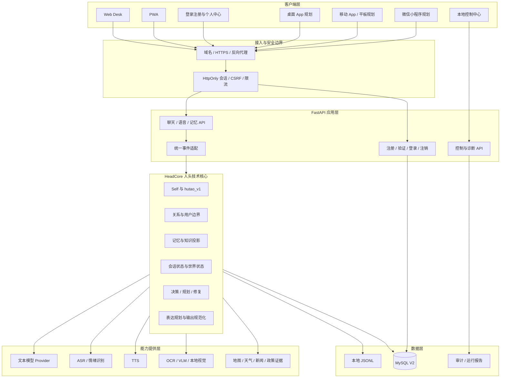
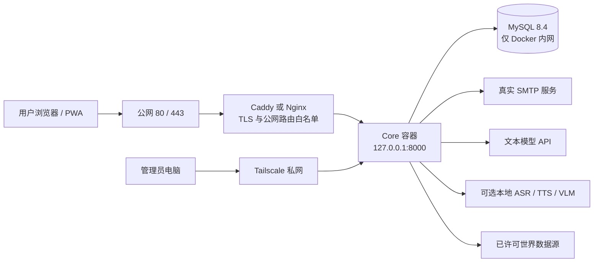
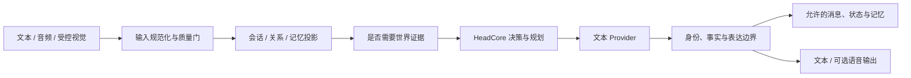
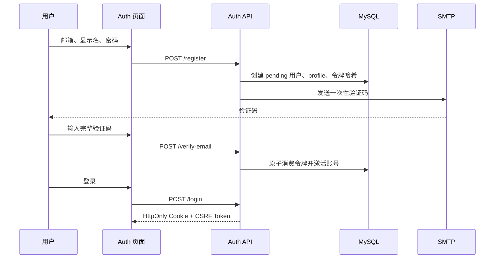

# HutaoChatCore 完整架构、功能逻辑与运行验收手册

> 当前主线版本：2026-07-30  
> 适用范围：本地开发、Web/PWA 功能验收、公开测试准备、Ubuntu 服务器部署与后续更新  
> 当前阶段：本地 Web 主线可运行，公开账号体系与服务器生产环境尚未完成联调

## 0. 文档定位

本文件是 HutaoChatCore 项目根目录下的当前架构与验收主线和唯一编辑源。代码、配置、部署方式或功能状态发生变化时，应优先更新本文件；`docs/HUTAOCHATCORE_COMPLETE_ARCHITECTURE_AND_ACCEPTANCE_MANUAL.md` 必须在同一次变更中同步为相同内容，作为发布阅读副本。

以下资料保留作历史记录或专项说明，不再覆盖本文件中的当前结论：

- `docs/history/agent-handoff-archive.md`：2026-07 至 2026-08 的完整开发交接历史，只读归档；其中的 QQ/微信 Bot、CosyVoice2、Bert-VITS2 等记录均为历史。
- `docs/HUTAOCHATCORE_COMPLETE_ARCHITECTURE_AND_ACCEPTANCE_MANUAL.md`：本文件的同步发布副本，不是第二个独立事实来源。
- `docs/archive/QQ_WEIXIN_BOT_RETIREMENT.md`：QQ/微信 Bot 退役说明。
- `docs/archive/RETIRED_QQ_WEIXIN_BOT_CONFIGURATION.md`：退役 Bot 配置归档。

本手册使用以下状态：

| 状态 | 含义 |
| --- | --- |
| 已实现 | 主线代码存在，并有自动化测试或本地运行证据 |
| 条件可用 | 代码已实现，但依赖数据库、模型、外部服务、许可或人工配置 |
| 部分实现 | 基础结构存在，但端到端流程仍有缺口 |
| 规划中 | 已确定设计方向，尚未形成可验收实现 |
| 已退役 | 不属于当前产品主线，不应重新接入当前控制中心或公开部署 |

除非明确写明“真实联调通过”，自动化测试通过不代表真实邮箱、DeepSeek、MySQL、语音模型、视觉模型或世界数据源已经在线可用。

## 1. 当前结论

HutaoChatCore 是以 **HeadCore（人头技术核心）** 为唯一认知主体的胡桃角色陪伴系统。当前产品主线是：

1. 电脑 Web 页面。
2. 可安装的 PWA。
3. 后续复用同一 API 的桌面 App、移动 App、平板界面和微信小程序。
4. 面向管理者的本地控制中心。
5. HeadCore、模型、记忆、语音、视觉、世界证据工具和存储系统。

当前不是可直接开放注册的生产版本。2026-07-30 的实际状态如下：

- `/desk`、`/auth`、`/me`、`/control`、`/health` 在本机均返回 HTTP 200。
- 当前本机配置未开启公开 Web 认证，`POST /api/v1/auth/login` 返回 404，这是开关关闭后的预期状态。
- Web Desk、PWA、逐段文本回复、按住说话的音频聊天、对话脉络、记忆读取/删除、控制中心和 HeadCore 主链路已经有实现。Desk 文本主路径使用 `/api/v1/chat/stream`；当前没有面向普通用户的通用音频文件上传控件。
- MySQL 账号表、邮箱验证令牌、可撤销会话、CSRF、认证审计和数据库限流已有代码与迁移基础。
- 登录、注册、邮箱验证码和个人中心页面已实现；真实 SMTP、真实 MySQL、会话隔离和邮件投递仍未联调。
- Dockerfile 和 `deploy/compose.staging.yml` 已建立 Core + MySQL 的内网部署骨架，但反向代理、域名、HTTPS、备份、公开限流与生产监控尚未完成。
- 项目测试口径为 `python -m pytest tests`。2026-08 项目清理后最新实测结果为 `814 passed, 2 skipped`；网页流式与 TTS 浏览器测试会输出两条上游 WebSocket 弃用警告，未出现项目测试失败。
- QQ、微信 Bot 不属于当前普通 Web 产品主线，也不在 `/desk`、`/auth`、`/me` 中暴露。历史适配代码已随 2026-08 清理整体移除，交接记录见 `docs/history/agent-handoff-archive.md`，不能作为当前公开功能展示或验收依据。

## 2. 产品目标与边界

### 2.1 产品目标

- 所有客户端连接同一个 HeadCore，不复制人格、关系、记忆或决策系统。
- 让胡桃在文本、语音和后续视觉输入中保持稳定身份、关系边界和表达风格。
- 每个正式账号拥有独立的会话、关系与记忆空间。
- 外部模型和世界 API 只是能力提供者，不能越过 HeadCore 直接控制人格或写入长期记忆。
- 本地开发、封闭测试和公开部署使用同一套代码，但通过配置和基础设施逐级开放能力。
- 普通用户界面、个人中心和管理控制中心严格分离。

### 2.2 当前非目标

- 不把 QQ、微信 Bot 恢复为当前客户端。
- 不宣称已经实现人类意识、AGI 或可持续模拟现实的通用世界模型。
- 不让普通测试用户编辑服务器 `.env`、系统提示词、全局模型 Key 或其他用户的数据。
- 不在未完成 HTTPS、数据库隔离、限流和备份前开放无限注册。
- 不把未经许可的网页、新闻全文或精确位置静默抓取到模型上下文或长期记忆。

## 3. 总体架构

### 3.1 当前与目标架构总图



图中的桌面 App、移动 App、平板和微信小程序是目标客户端，不代表当前已经发布。当前可运行客户端是 Web Desk 与 PWA。

### 3.2 生产部署拓扑



生产环境必须保持以下边界：

- MySQL 不映射公网端口。
- Core 当前 Compose 只绑定 `127.0.0.1:8000`，由反向代理提供 HTTPS。
- `/control`、`/api/control/*`、`/api/internal/*`、`/v1/*`、OpenAPI 文档不对普通公网用户开放。
- 管理访问优先通过 Tailscale 或服务器本机完成。
- `.env`、备份、日志、模型权重和用户数据不进入 Git 或公开下载目录。

## 4. 项目目录与模块职责

| 路径 | 主要职责 | 当前状态 |
| --- | --- | --- |
| `app/main.py` | FastAPI 组装、页面路由、聊天、音频和记忆 API、认证开关接入 | 已实现 |
| `app/head/` | HeadCore 状态、决策、规划、反馈、世界状态与长期计划 | 已实现，持续进阶 |
| `app/services/chat_service.py` | 对话主服务、模型调用、记忆与世界上下文接入 | 已实现 |
| `app/persona/` | `hutao_v1` 人格、关系、场景、语气和重复控制 | 已实现 |
| `app/mind/` | 对话、自我和社会状态 | 已实现 |
| `app/dialogue/` | 对话行为、表达策略、纠错与修复 | 已实现 |
| `app/expression/` | 输出规划、集成与 Core API 文本规范化 | 已实现 |
| `app/providers/` | DeepSeek、ASR、TTS 等 Provider 注册、路由、熔断 | 条件可用 |
| `app/storage/` | JSONL、MySQL V2、PostgreSQL、Database V2 仓库和关系服务 | JSONL 已实现，MySQL V2/PostgreSQL 条件可用 |
| `app/knowledge/` | 知识候选、生命周期、投影权限和持久化 | 条件可用 |
| `app/auth/` | 邮箱注册、密码、会话、当前账号、CSRF、审计、限流、SMTP | 已实现，待真实 MySQL/SMTP 联调 |
| `app/audio/` | 文件/流式转写、音频质量、情绪识别和语音聊天输入 | 条件可用 |
| `app/voice_chat/` | 本地 TTS 适配与规划 | 条件可用 |
| `app/workbench/` | 管理员本机视觉工作台（默认关闭） | 基础已实现，默认关闭 |
| `app/camera/` | 明示同意下的短时本地相机感知 | 基础已实现，默认关闭 |
| `app/world/` | 地图、天气、新闻、政策、缓存、来源许可和冲突处理 | 基础已实现，默认关闭 |
| `app/control/` | 本地控制中心、配置、服务、日志和测试入口 | 已实现，必须内网使用 |
| `app/operations/` | 状态聚合、审计、脱敏、探针和报告 | 已实现 |
| `app/static/web/studio/` | Web Desk、PWA、响应式界面 | 已实现 |
| `app/static/auth/` | 登录、注册、邮箱验证码与结果页面 | 已实现 |
| `app/static/profile/` | 个人资料、记忆管理、安全状态与注销页面 | 已实现，部分账号能力待补齐 |
| `app/static/control/` | 管理控制中心页面 | 已实现 |
| `migrations/v2/` | MySQL V2、知识、人格与公开账号迁移 | 已实现，待真实库应用 |
| `deploy/` | Ubuntu/Docker 测试部署模板 | 基础已实现 |
| `tests/` | 项目主线自动化测试 | 已实现 |
| 历史 OneBot、QQ/微信集成文件 | 退役 Bot 代码 | 已移除（2026-08 清理） |

## 5. 客户端与界面设计

### 5.1 Web Desk

`/desk` 是当前最重要的普通用户入口。它的优先级是“能稳定对话，再呈现角色氛围”，而不是把角色舞台做成遮挡聊天的装饰页。当前页面由角色舞台、核心状态、对话主面板和紧凑的个人中心入口组成，提供：

- `/health`、浏览器麦克风能力和 `/api/v1/voice/status` 驱动的三个能力状态，分别反映文字对话、按住说话和回复语音是否可用。
- 流式文字聊天；首个有效文本片段前显示独立的“正在思考 · 耗时”状态，不把等待伪装成胡桃已经回复。
- 文本与“按住说话”两种互斥输入模式。浏览器以 `MediaRecorder` 录制一次音频 Blob，松开后提交到 `/api/v1/audio/chat/file`；这不是实时语音通话，也不是任意文件上传入口。
- 对话、对话脉络和记忆三个视图；对话脉络读取 `/api/v1/dialogue-context`，记忆按当前会话授权边界读取。
- 仅在服务端启用且本条回复持有有效 `reply_id` 时显示按需 TTS 播放控制。
- PWA 安装资源与静态离线壳缓存。

#### 三端布局规则

Desk 使用流式宽度与断点重排，不以三张固定效果图作为最终适配目标。桌面、平板和手机只是验收分类；在断点之间连续拖动时，不能出现内容宽度不变、被遮挡、横向溢出或聊天区长期留空。

| 范围 | 当前布局 | 关键规则 |
| --- | --- | --- |
| 宽屏桌面，`>=1200px` | 左侧紧凑角色舞台，右侧为最大面积的聊天主面板 | 隐藏重复的身份栏；聊天区最小宽度 540px，不因角色图挤压输入和消息。 |
| 平板与小屏桌面，`768px-1199px` | 竖屏时角色舞台位于聊天上方；横屏 `1024px-1199px` 时恢复两列 | 角色舞台高度受限，聊天消息宽度可收缩；不显示重复身份栏。 |
| 手机，`<=767px` | 直接进入聊天，角色舞台与身份栏均隐藏 | 保留固定输入区、底部视图导航和安全区间距；不以缩小角色图替代可读聊天空间。 |
| 极窄/低高度手机 | 继续压缩非必要装饰与间距 | 文字、按住说话、发送、状态和导航始终可操作；Toast 避开底部导航。 |

#### 视觉与防误操作规则

- 视觉系统使用深色夜景、朱砂、鎏金和青玉作为角色化色彩；共享主题位于 `app/static/shared/theme.css`，不允许各页面自行发明另一套色板、圆角或字体尺度。
- `ambient.js` 的灯火、花瓣粒子、角色呼吸、签条摆动和唱片旋转均是可降级的氛围层：不接收指针事件，尊重 `prefers-reduced-motion`，在页面隐藏时停止动画。触屏设备不依赖自定义鼠标指针。
- 精细指针设备使用胡桃指针资源区分普通、链接、文本、忙碌和禁用状态；浏览器无法加载自定义指针时必须自然回退到系统指针。
- 所有可点击控件保留键盘焦点、可见焦点环、禁用态和触屏命中区域。提交时锁定输入与录音，防止重复请求；失败时恢复控件并给出可理解的提示。
- 顶栏唱片按钮只在用户主动点击时加载网易云纯音乐 iframe。该 iframe 是跨域播放器，页面不能读取精确播放状态；跨完整页面跳转目前会重新创建播放器，不能宣称无缝续播。
- 登录注册和个人中心是独立任务页，不为迁就其布局反向破坏 Desk 的对话主界面。

### 5.2 PWA

PWA 资源位于：

- `app/static/web/studio/manifest.webmanifest`
- `app/static/web/studio/service-worker.js`

当前 PWA 提供可安装的 Web 壳和静态资源缓存，不等于原生 App。麦克风、通知、后台任务和文件能力仍受浏览器与系统权限限制。

### 5.3 登录与注册

`/auth` 当前包含登录、注册、邮箱验证码、验证完成、申请重置、设置新密码、字段校验、密码显示控制、忙碌锁和错误恢复。后端已有：

- `POST /api/v1/auth/register`
- `POST /api/v1/auth/verify-email`
- `POST /api/v1/auth/login`
- `POST /api/v1/auth/logout`
- `GET /api/v1/auth/me`
- `POST /api/v1/auth/password-reset/request`
- `POST /api/v1/auth/password-reset/confirm`

`GET /api/v1/auth/status` 始终可用，只公开认证、注册与密码重置是否启用，不返回数据库、SMTP、主机名或秘密配置。

这些路由是条件注册的：

```text
登录/注销 API：
PUBLIC_WEB_AUTH_ENABLED=true
+ DATABASE_V2_ENABLED=true
+ MySQL 数据库名、用户、密码完整

注册/邮箱验证 API：
满足以上条件
+ EMAIL_DELIVERY_ENABLED=true
+ SMTP 主机、用户名、密码、发件地址完整
```

密码重置 API 与注册/邮箱验证使用完全相同的 SMTP 条件；服务未满足条件时，`/api/v1/auth/password-reset/request` 与 `/api/v1/auth/password-reset/confirm` 不会挂载。

当前真实缺口与页面行为：

- 本机这些开关仍关闭，因此认证 API 当前返回 404。
- `/auth` 会先读取 `/api/v1/auth/status`。服务关闭时，字段仍可用于查看表单结构和本地校验，但提交按钮保持禁用，并明确说明“当前表单仅供预览”；不得显示伪造的登录或注册成功结果。
- SMTP 适配器发送的是需要提交到验证 API 的验证码，不是自动验证链接；页面已按验证码流程实现。
- 验证成功后不会自动创建登录会话，用户仍需返回登录。
- 忘记密码与更新密码流程已实现；重发验证、修改邮箱和异常账号恢复流程尚未实现，真实邮件投递也未验收。
- 真实 MySQL 尚未应用 `004_public_web_auth.sql` 与 `005_public_web_password_reset.sql`，因此认证表与重置令牌表尚不存在。

### 5.4 个人中心

`/me` 已形成普通用户个人中心，与 `/control` 完全分离。当前页面包括：

1. 基本资料：显示名称、邮箱状态、账号创建时间。
2. 安全状态：当前会话到期时间与退出当前账户。
3. 记忆：查看当前账号记忆、空状态、读取错误和二次确认删除。
4. 访问状态：未登录时引导登录；公开认证关闭时显示“本地体验模式”，明确当前浏览器可继续文字对话和按住说话、不能跨设备同步或形成登录账户资料，并且不重复请求不存在的认证路由。

尚未实现修改密码、活跃会话列表、撤销其他会话、登录记录、记忆导出、使用额度和数据权利申请。这些能力仍属于后续账号闭环。

普通用户不能直接编辑服务器 `.env`。未来的用户 API Key 必须使用独立数据库表、服务端加密、只显示掩码、不可回显原值、可撤销，并由审计记录所有变更。当前代码尚未实现这套每用户凭据系统。

### 5.5 控制中心

`/control` 是管理员和开发者的本地运维页面，不是普通用户个人中心。它负责查看：

- Core、Provider、数据库、记忆和能力状态。
- Web/PWA 与后续客户端状态。
- 日志尾部、测试报告和错误聚合。
- 世界工具、语音、视觉等本地能力是否具备运行条件。

源码中仍存在配置写入、服务启停和测试执行 API。这些写操作需要管理员身份头和审计，但当前尚未建立正式浏览器管理员会话。因此公开部署必须在反向代理层完全阻断控制面，不能只依赖前端隐藏按钮。

### 5.6 后续客户端

| 客户端 | 推荐技术方向 | 与 Core 的关系 | 状态 |
| --- | --- | --- | --- |
| 桌面 App | Tauri 或现有 Web/PWA 封装 | 复用 HTTPS API、会话和同一 HeadCore | 暂停，等待 Web 公开可用 |
| Android/iOS App | Flutter 或 React Native，确定一种后再实施 | 复用 API，增加系统通知和原生录音权限 | 暂停，等待 Web 公开可用 |
| 平板 | 响应式 Web/PWA 优先，必要时复用移动 App | 不建立独立后端 | 当前由 Web/PWA 覆盖，不单独立项 |
| 微信小程序 | 小程序原生界面 + HTTPS API | 仅作为客户端，不恢复微信 Bot | 暂停，等待 Web 公开可用 |

小程序与桌宠均不属于当前研发冲刺。客户端技术未正式选型前，不应同时维护多套半成品框架；先完成 Web API、认证、记忆隔离、公开测试和运维闭环，再选择一个移动技术栈。

## 6. HeadCore 功能逻辑

### 6.1 唯一认知主体

运行时人格固定为 `hutao_v1`。客户端、模型、ASR、TTS、视觉或世界工具都不能创建第二套 Self、关系或长期记忆。



### 6.2 HeadCore 内部职责

- `state.py`、`world_state.py`：维护当前认知和世界状态表达。
- `decision.py`、`planning.py`：形成当前回合决策与步骤。
- `long_term_planning.py`、`long_term_plan_store.py`：长期计划结构与存储。
- `feedback.py`、`adaptation.py`、`calibration.py`：反馈、调整和校准。
- `world_evidence.py`、`world_model.py`、`world_model_store.py`：管理有限、可追踪的世界状态与证据，不是通用物理模拟器。
- `runtime.py`：把渠道事件、用户主体、会话和 ChatService 组合成统一运行入口。

### 6.3 模型与 HeadCore 的边界

文本模型负责理解和生成候选表达，HeadCore 负责身份、关系、上下文、事实边界、决策和最终输出规范。模型不可直接：

- 决定当前用户是谁。
- 选择或修改数据库中的其他用户资料。
- 把外部网页全文写入长期记忆。
- 自动启用摄像头、定位、新闻抓取或高成本工具。
- 返回或记录 API Key、密码、Cookie、CSRF Token 和数据库凭据。

## 7. 端到端功能流程

### 7.1 本地开发文本聊天

公开认证关闭时：

1. Desk 在浏览器本地生成开发会话 ID 和本地用户 ID。
2. Desk 通过 `POST /api/v1/chat/stream` 接收流式请求；`POST /api/v1/chat` 仍保留为非流式兼容入口。
3. `CoreApiEventAdapter` 将请求转换为统一 `ChannelEvent`。
4. `HeadRuntime` 和 `ChatService` 读取允许的关系、记忆与可选世界上下文。
5. 文本 Provider 生成候选回答。
6. 表达层规范化回答并返回 Desk。

这种模式只适合单机开发，不具备跨设备正式身份保证。

### 7.2 正式账号聊天

公开认证开启时：

1. 浏览器持有 `HttpOnly` 的 `hutao_session` Cookie，脚本不能读取会话原文。
2. 登录响应同时设置可读、`SameSite=Lax` 的 `hutao_csrf` Cookie 并返回同一 CSRF Token；当前前端优先使用 `sessionStorage`，跨标签页或刷新后可从 CSRF Cookie 恢复。
3. 聊天、流式聊天、音频聊天和记忆写操作必须发送 `X-CSRF-Token`。
4. 服务端从会话记录解析 `profile_id` 和会话 ID。
5. 服务端覆盖前端提交的 `user_id`、`session_id`，并拒绝伪造的平台身份字段。
6. 记忆查询和删除只允许当前 `profile_id`。

前端提交的 ID 不能作为授权依据。该规则已经进入 API 代码和测试，但还需要真实 MySQL 会话联调。

### 7.3 注册与邮箱验证



密码使用 Argon2id。数据库只保存会话 Token、CSRF Secret 和邮箱验证 Token 的哈希，不保存其原文。

### 7.3.1 密码重置

1. 用户在 `/auth` 提交注册邮箱到 `POST /api/v1/auth/password-reset/request`。
2. 无论邮箱是否存在、状态是否可用，接口都返回相同的受理结果，避免枚举账号。
3. 对活跃账号，服务端生成一次性随机重置码，只保存 SHA-256 哈希，并通过已配置的 SMTP 发往该邮箱。
4. 用户将邮件中的完整重置码和符合现行策略的新密码提交到 `POST /api/v1/auth/password-reset/confirm`。
5. MySQL 在同一事务内锁定并消费令牌、更新 Argon2id 密码哈希、撤销该账号全部未撤销会话；令牌过期、已用或无效时统一拒绝。

请求与确认均使用数据库限流。前端不保存重置码，也不在 URL、日志或提示中回显；真实 SMTP、迁移、过期、重放和两账号隔离仍需线上验收。

### 7.4 记忆与关系

- JSONL 是当前单机默认存储。
- MySQL V2 用于正式账号、跨端会话、关系、消息、记忆、知识和审计。
- 记忆读取按 `profile_id` 投影。
- 单条删除使用 `profile_id + memory_id` 限定，防止 IDOR。
- 外部网页全文、精确位置、认证凭据和高敏感原始输入默认不进入长期记忆。
- 个人中心已支持记忆列表与二次确认删除；导出、记忆偏好和完整数据权利流程尚未实现。

### 7.5 音频

1. 用户切换到按住说话模式，并在浏览器授权后按住录音；若浏览器不支持 `getUserMedia` 或 `MediaRecorder`，页面明确提示不可用。
2. 松开后浏览器停止录音、关闭麦克风轨道，并将单个音频 Blob 与会话信息提交到 `/api/v1/audio/chat/file`。
3. 服务端保存临时文件、执行转写和质量门；ASR 判断不可靠时应请用户重说，而不是伪造转写文本。
4. 有效文本进入与普通聊天相同的 HeadCore 链路，页面展示转写内容、独立的“正在听你说”状态和最终文字回复。
5. TTS 是受控表达 Provider，不能持有人格和记忆。它默认关闭，仅允许已认证会话播放本次流式回复登记的短时 `reply_id`，并受字数、频率、并发和临时文件生命周期限制。

这不是连续实时语音、浏览器视频对话或通用文件上传。当前音频路由和测试存在，但真实麦克风权限、模型延迟、噪声、长音频、显存占用、胡桃音色听感和跨进程限流仍需人工验收。

### 7.6 视觉与相机

视觉和相机是默认关闭的本地感知能力：

- 必须显式开启并创建有时限的同意会话。
- 默认不保存原始帧、不做人脸身份识别、不上传云端。
- OCR/VLM 输出经过允许标签、置信度、时效和长度约束。
- 当前 Web Desk 没有完整的普通用户相机工作流。
- 服务器无物理相机时，不应把相机能力当作线上必需服务。

### 7.7 世界证据工具

项目当前的“世界模型”包含两部分：

1. HeadCore 内部的有限世界状态、事实和计划结构。
2. `app/world/` 提供的受控外部证据工具。

它不是训练完成的通用世界模拟模型。外部工具只在用户明确请求且配置、许可、同意条件满足时执行。

| 能力 | 当前适配 | 默认状态 | 关键边界 |
| --- | --- | --- | --- |
| 行政区、地点、路线 | 高德 Web Service | 关闭 | 精确路线需明确请求和同意 |
| 当前天气、预报 | 和风天气 | 关闭 | 不从请求 IP 猜位置 |
| 新闻摘要 | GDELT、官方 RSS 等 | 来源逐项关闭 | 来源必须启用并完成许可审核 |
| 政策更新 | 政府公开元数据 | 关闭 | 不抓取并保存不受控全文 |
| 证据整理 | 缓存、去重、过期和冲突规则 | 已实现 | 冲突信息应保留不确定性 |

## 8. API 边界

### 8.1 普通用户与客户端 API

| 路径 | 方法 | 用途 | 认证要求 |
| --- | --- | --- | --- |
| `/health` | GET | 本地健康检查 | 当前无认证，不建议直接公网开放 |
| `/api/v1/chat` | POST | 文本聊天 | 公开认证开启后要求会话 + CSRF |
| `/api/v1/chat/stream` | POST | 流式文本聊天 | 公开认证开启后要求会话 + CSRF |
| `/api/v1/dialogue-context` | GET | 当前会话的状态、正在跟进事项和待确认问题 | 公开认证开启后从会话取 profile |
| `/api/v1/voice/status` | GET | 网页语音播放非敏感状态 | 始终只返回可用布尔状态与长度上限 |
| `/api/v1/voice/synthesize` | POST | 已登记回复的短时音频 | 仅公开认证 + TTS 开关开启；会话、CSRF、回复 ID、频率和并发受控 |
| `/api/v1/audio/transcribe/file` | POST | 单独音频转写 | 当前未接入正式账号授权，公开前需补齐 |
| `/api/v1/audio/chat/file` | POST | 音频转写后聊天 | 公开认证开启后要求会话 + CSRF |
| `/api/v1/audio/transcribe/stream` | WebSocket | 流式音频转写 | 公开前必须单独复核 WebSocket 认证 |
| `/api/v1/memories` | GET | 当前账号记忆列表 | 公开认证开启后从会话取 profile |
| `/api/v1/memories/{memory_id}` | DELETE | 删除当前账号记忆 | 会话 + CSRF + profile 限定 |

### 8.2 账号 API

| 路径 | 方法 | 状态 |
| --- | --- | --- |
| `/api/v1/auth/register` | POST | 条件注册，需 MySQL + SMTP |
| `/api/v1/auth/verify-email` | POST | 条件注册，验证码只允许放请求体 |
| `/api/v1/auth/login` | POST | 条件注册，设置 HttpOnly Cookie |
| `/api/v1/auth/logout` | POST | 条件注册，要求 CSRF 并撤销服务端会话 |
| `/api/v1/auth/me` | GET | 条件注册，从服务端会话返回当前账号资料 |
| `/api/v1/auth/password-reset/request` | POST | 条件注册，通用受理结果，不返回重置码 |
| `/api/v1/auth/password-reset/confirm` | POST | 条件注册，重置码只允许放请求体，成功后撤销旧会话 |
| `/api/v1/auth/status` | GET | 始终可用，只返回认证、注册与密码重置功能开关状态 |

### 8.3 内部与管理 API

- `/control` 与 `/api/control/*`：管理控制面。
- `/api/internal/*`：内部服务间接口。
- `/v1/chat/completions`：OpenAI-Compatible 兼容入口。
- `/docs`、`/redoc`、`/openapi.json`：开发文档。

这些路径不得默认向普通公网开放。当前控制写入鉴权仍依赖内部管理员主体，不是完整的 Web 管理员登录体系。

## 9. 数据库设计

### 9.1 存储模式

| 模式 | 配置 | 用途 | 适用阶段 |
| --- | --- | --- | --- |
| JSONL | `STORAGE_BACKEND=jsonl` | 单机聊天与开发数据 | 当前本地开发 |
| MySQL V2 | `DATABASE_V2_ENABLED=true`（配好 `MYSQL_*`） | 账号、跨端会话、关系、消息、记忆、知识和审计 | 封闭测试与生产 |
| PostgreSQL | `STORAGE_BACKEND=postgresql`（配好 `POSTGRES_*`） | 公开 Web 账号运行库 | 条件可用 |

### 9.2 V2 迁移顺序

必须在备份后按顺序执行：

1. `migrations/v2/001_hutao_chat_core_schema.sql`
2. `migrations/v2/002_knowledge_lifecycle.sql`
3. `migrations/v2/003_persona_management.sql`
4. `migrations/v2/004_public_web_auth.sql`
5. `migrations/v2/005_public_web_password_reset.sql`
6. `migrations/v2/006_semantic_memory_outbox.sql`（仅启用语义记忆时）

`004_public_web_auth.sql` 增加：

- `web_users`
- `email_verification_tokens`
- `web_sessions`
- `registration_attempts`
- `auth_audit_events`

`005_public_web_password_reset.sql` 增加 `password_reset_tokens`，并扩展 `auth_audit_events` 的事件枚举。原始重置码不进入数据库；每次新申请会使该用户更早的未使用重置码失效。

迁移当前不是 Core 启动时自动执行的。部署者必须显式执行、记录结果，并在失败时停止发布。

### 9.3 身份与隔离

```text
email -> web_user -> profile -> conversations / messages / memories
                     |
                     +-> web_sessions / relationship / persona projection
```

- 邮箱规范化后唯一。
- 一个 Web 用户绑定一个 profile。
- profile 是关系、会话和记忆授权边界。
- UUID 用作公开实体 ID，不使用可枚举连续编号。
- Token 原文只在签发时返回一次，数据库保存哈希。
- 管理员查询用户数据必须经过独立授权和审计，不能复用普通个人中心接口。

## 10. 配置设计

### 10.1 配置文件职责

| 文件 | 用途 | 是否提交 |
| --- | --- | --- |
| `.env.example` | 当前无秘密配置模板 | 可以 |
| `.env` | 本机运行秘密与开关 | 不可以 |
| `deploy/.env.staging.example` | 服务器测试环境模板 | 可以 |
| `deploy/.env.staging` | 服务器真实密码、Key 和开关 | 不可以，权限应为 600 |

任何测试用户都不应获得 `.env`。控制中心只能向管理员显示脱敏后的“是否已配置”，不能回显秘密原文。

### 10.2 关键启用门

| 能力 | 必要条件 |
| --- | --- |
| 文本模型 | Provider 名称、Base URL、模型名、有效 API Key |
| MySQL V2 | MySQL 可达、迁移完成、`DATABASE_V2_ENABLED=true` |
| 公开登录 | MySQL V2 条件 + `PUBLIC_WEB_AUTH_ENABLED=true` |
| 邮箱注册 | 公开登录条件 + SMTP 完整 + `EMAIL_DELIVERY_ENABLED=true` |
| 密码重置 | 邮箱注册条件 + `005_public_web_password_reset.sql` 已迁移 |
| HTTPS Cookie | 已有真实 HTTPS 后设置 `SESSION_COOKIE_SECURE=true` |
| 世界工具 | 全局开关 + 单来源启用 + 来源许可 + 必要 Key |
| 相机 | 感知开关 + 本地捕获开关 + 明示同意会话 |
| 公开网页 TTS | 公开认证条件 + `PUBLIC_WEB_TTS_ENABLED=true` + 已验收的语音 Provider 和共享限流 |

不要一次打开全部开关。正确顺序是：依赖就绪、迁移、单项 smoke、备份、启用、验收、再进入下一项。

## 11. 功能状态矩阵

| 功能 | 代码状态 | 本地自动化 | 真实联调 | 公开发布结论 |
| --- | --- | --- | --- | --- |
| Web Desk | 已实现 | 已覆盖 | 本机页面可访问；文字、按住说话、能力状态、对话脉络与记忆视图已接线 | 可继续本地测试 |
| PWA 壳与缓存 | 已实现 | 已覆盖 | 浏览器可加载 | 需 HTTPS 后做安装验收 |
| 响应式布局 | 已实现并持续修正 | Desk 回归存在 | 已检查 1440x960、1024x768、390x844；仍需连续宽度人工验收 | 公开前继续全宽度人工验收 |
| 文本聊天 API | 已实现 | 已覆盖 | 取决于模型 Key | 条件可用 |
| 流式聊天 API | 已实现 | 已覆盖 | Desk 逐段渲染、UTF-8 分块和中断提示已覆盖 | 条件可用 |
| 按住说话音频聊天 | 已实现 | 已覆盖 | 真实设备与模型未全量验收；非实时通话 | 条件可用 |
| TTS | 本地 Provider 与网页短时播放接口存在 | 状态机、接口和浏览器隔离测试已覆盖 | 真实模型听感、性能、认证环境与跨进程共享限流未验收 | 条件可用，默认关闭 |
| 记忆读取/删除 | 已实现 | 已覆盖 | MySQL 账号隔离待真实联调 | 条件可用 |
| HeadCore 状态与规划 | 已实现 | 已覆盖 | 长期真实对话仍需盲评 | 持续进阶 |
| 世界证据工具 | 基础已实现 | 已覆盖 | 真实来源默认关闭 | 不默认公开 |
| 本地视觉/相机 | 基础已实现 | 已覆盖 | 真实相机和 VLM 条件验收 | 不默认公开 |
| MySQL V2 | Schema 与仓库已实现 | 单元/集成边界覆盖 | 当前未应用生产库 | 未完成生产验收 |
| 邮箱注册后端 | 部分实现 | 已覆盖 | 真实 SMTP 未配置 | 暂不可开放 |
| 登录/注销后端 | 部分实现 | 已覆盖 | 当前本机开关关闭 | 暂不可开放 |
| 登录/注册/验证码/重置页面 | 已实现 | 表单状态、校验和服务关闭降级已覆盖 | MySQL、SMTP、真实投递与会话隔离未完成 | 暂不可开放 |
| 个人中心 | 已实现 | 已覆盖 | 本地体验模式、未登录引导、账户资料/记忆/注销页面已具备；账号服务仍未联调 | 暂不构成公开账号闭环 |
| 用户自带模型 API Key | 未实现 | 无 | 无 | 必须先完成服务端加密、掩码、撤销与审计，当前不展示设置入口 |
| CAPTCHA/Turnstile | 规划中 | 无 | 未完成 | 阻塞开放注册 |
| 账号/模型调用配额 | 规划中 | 无 | 未完成 | 阻塞防白嫖目标 |
| Redis/多进程共享限流 | 规划中 | 无 | 未完成 | 多实例前必须完成 |
| Docker Core + MySQL | 基础已实现 | 部署文件测试已覆盖 | Ubuntu 未完整发布验收 | 仅适合部署演练 |
| 域名/HTTPS/反向代理 | 规划中 | 无 | 未完成 | 阻塞公网开放 |
| 自动备份与恢复演练 | 规划中 | 无 | 未完成 | 阻塞长期公开测试 |
| 桌面 App / 桌宠 | 暂停 | 无 | 未开始 | 等待 Web 公开可用后再立项 |
| 移动 App/平板 | 平板由响应式 Web 覆盖；原生 App 暂停 | 无 | 未开始 | 等待 Web 公开可用后再立项 |
| 微信小程序 | 基础工程存在，当前暂停 | 无 | 未开始 | 等待 Web 公开可用后再立项 |
| QQ/微信 Bot | 已退役 | 历史测试仍留存 | 不验收 | 不属于当前主线 |

## 12. 本地开发运行

### 12.1 当前 Windows 开发环境

项目约定使用：

```text
D:\Tool\Progrmming-Tool\anaconda\envs\new\python.exe
```

启动 Core：

```powershell
cd D:\Programming-file\Graduation-Project\HutaoChatCore
& 'D:\Tool\Progrmming-Tool\anaconda\envs\new\python.exe' -m uvicorn app.main:app --host 127.0.0.1 --port 8000
```

本地入口：

- Web Desk：`http://127.0.0.1:8000/desk`
- 登录注册：`http://127.0.0.1:8000/auth`
- 个人中心：`http://127.0.0.1:8000/me`
- 控制中心：`http://127.0.0.1:8000/control`
- 健康检查：`http://127.0.0.1:8000/health`
- API 文档：`http://127.0.0.1:8000/docs`

### 12.2 最快检查

```powershell
Invoke-WebRequest -UseBasicParsing http://127.0.0.1:8000/health
Invoke-WebRequest -UseBasicParsing http://127.0.0.1:8000/desk
Invoke-WebRequest -UseBasicParsing http://127.0.0.1:8000/auth
Invoke-WebRequest -UseBasicParsing http://127.0.0.1:8000/me
Invoke-WebRequest -UseBasicParsing http://127.0.0.1:8000/control
```

### 12.3 自动化验收

```powershell
cd D:\Programming-file\Graduation-Project\HutaoChatCore
& 'D:\Tool\Progrmming-Tool\anaconda\envs\new\python.exe' -m compileall -q app scripts
& 'D:\Tool\Progrmming-Tool\anaconda\envs\new\python.exe' -m pytest tests -q -p no:cacheprovider
```

不要在仓库根目录直接运行无范围的 `pytest`。仓库包含 `external/GPT-SoVITS` 自带的第三方测试与独立运行时，裸命令会错误收集外部 CUDA、Crypto、SymPy、Torch 等测试。项目正式口径始终是 `pytest tests`。

### 12.4 浏览器验收

不能只看三张固定截图。至少检查以下宽度以及它们之间的连续拖动：

- 320px：窄手机下限。
- 390px、450px：常见手机。
- 768px：竖屏平板。
- 1024px：平板/小屏电脑。
- 1280px、1440px、1920px：电脑与宽屏。

每个宽度检查：

- `document.documentElement.scrollWidth === window.innerWidth`，除非页面明确设计为局部横向滚动。
- 页面内容跟随宽度重排，不被遮挡，不出现无意义固定空白区。
- 输入框、发送、按住说话、模式切换、导航和状态文本不重叠。
- 长中文、英文、数字、错误提示和加载状态不会撑破容器。
- 浏览器控制台没有错误和警告。
- Desk、认证页和控制中心分别验收，不能用一个页面的结果代替另一个页面。

## 13. 本地 MySQL 与认证联调顺序

本阶段使用 Docker 只做本机联调，不等于公网部署。

1. 从模板创建仅本机使用的部署配置：

```powershell
Copy-Item deploy\.env.staging.example deploy\.env.staging
```

2. 在 `deploy/.env.staging` 填写随机且唯一的 MySQL 密码，不要把内容发到聊天、日志或截图。

3. 先启动 MySQL：

```powershell
docker compose --env-file deploy/.env.staging -f deploy/compose.staging.yml up -d mysql
docker compose --env-file deploy/.env.staging -f deploy/compose.staging.yml ps
```

4. 完成备份与隔离恢复演练后，按顺序应用五个 V2 迁移。执行前先确认目标是测试库。

5. 当前 Compose 没有把 MySQL 映射到 Windows 宿主机。如果 Core 在 Windows 直接运行，需要另建只绑定 `127.0.0.1` 的 MySQL 端口映射，或者让 Core 也通过 Compose 运行。不要把 3306 暴露到公网。

6. 先启用 `DATABASE_V2_ENABLED` 和 MySQL 存储并跑数据库验收，再启用公开认证。

7. 配置真实 SMTP 后再启用 `EMAIL_DELIVERY_ENABLED`。登录、注册、邮箱验证和找回密码页面已具备受控交互；仍须以真实邮箱完成投递、过期、重放和会话撤销联调。

8. 验收两个不同账号不能读取、删除或推断对方的会话与记忆。

## 14. Ubuntu 服务器准备

目标服务器账户使用普通用户 `qcml`，需要管理操作时使用 `sudo`。不要长期以 root 登录或运行项目容器。

### 14.1 必备软件

- Ubuntu 当前受支持版本。
- OpenSSH Server。
- Git。
- Docker Engine。
- Docker Compose Plugin。
- Tailscale。
- 防火墙工具，例如 UFW。
- 后续公网阶段的 Caddy 或 Nginx。

服务器检查：

```bash
whoami
hostname
docker --version
docker compose version
git --version
tailscale status
sudo systemctl status docker --no-pager
```

建议目录：

```bash
sudo mkdir -p /opt/hutaochatcore
sudo chown qcml:qcml /opt/hutaochatcore
```

SSH 使用已经建立的专用密钥。Windows 侧示例：

```powershell
ssh -i "$env:USERPROFILE\.ssh\hutao_server_ed25519" qcml@<TAILSCALE_IP>
```

私钥文件不能复制到服务器、项目目录或 Git。

## 15. 从开发电脑上传服务器

### 15.1 推荐方案：私有 Git 仓库

推荐工作流：

```text
Windows 开发与测试
  -> 提交到私有 Git 仓库
  -> Ubuntu git pull --ff-only
  -> 备份
  -> 数据库迁移
  -> Docker 重新构建
  -> 健康检查
  -> 发布或回滚
```

当前项目目录尚未建立可用的 Git 仓库。正式使用前应：

1. 创建私有仓库。
2. 确认 `.gitignore` 已排除 `.env`、`deploy/.env.staging`、日志、模型、训练数据和运行数据。
3. 首次提交前使用 `git status` 和 `git ls-files` 检查没有秘密文件。
4. 服务器只拉取源码，服务器 `.env.staging` 独立保存。

服务器首次拉取：

```bash
cd /opt/hutaochatcore
git clone <PRIVATE_REPOSITORY_URL> .
cp deploy/.env.staging.example deploy/.env.staging
chmod 600 deploy/.env.staging
```

### 15.2 临时方案：SCP 发布包

没有私有 Git 时，可以在 Windows 生成明确排除秘密、日志、模型和运行数据的发布包，再通过 Tailscale SCP 上传。发布包必须至少排除：

- `.env`、真实部署配置。
- `logs/`、`tmp/`、`output/`。
- `external/`、`model_training/`、`node_modules/`。
- 数据库备份、用户上传和模型权重。

上传示例：

```powershell
scp -i "$env:USERPROFILE\.ssh\hutao_server_ed25519" .\HutaoChatCore-release.tar.gz qcml@<TAILSCALE_IP>:/home/qcml/
```

SCP 适合第一次演练，不适合长期版本管理和可靠回滚。

## 16. Docker 部署与更新

### 16.1 当前部署文件

- `Dockerfile`：Python 3.11 slim，安装音频系统库，以非 root 用户 `hutao` 运行 Core。
- `deploy/compose.staging.yml`：MySQL 8.4 + Core，MySQL 仅容器内网，Core 绑定主机 `127.0.0.1:8000`。
- `.dockerignore`：排除 `.env`、模型、训练数据、日志、输出和外部运行时，避免镜像过大或泄密。

当前镜像不包含 `external/` 与 `model_training/`，因此不会自动带上 GPT-SoVITS、CosyVoice 或大型本地模型。这些能力必须作为独立本地服务部署，或继续使用外部 Provider。

### 16.2 首次启动

```bash
cd /opt/hutaochatcore
docker compose --env-file deploy/.env.staging -f deploy/compose.staging.yml config --quiet
docker compose --env-file deploy/.env.staging -f deploy/compose.staging.yml build core
docker compose --env-file deploy/.env.staging -f deploy/compose.staging.yml up -d
docker compose --env-file deploy/.env.staging -f deploy/compose.staging.yml ps
curl --fail http://127.0.0.1:8000/health
```

在数据库迁移和真实认证验收完成前，保持：

```env
DATABASE_V2_ENABLED=false
PUBLIC_WEB_AUTH_ENABLED=false
EMAIL_DELIVERY_ENABLED=false
SESSION_COOKIE_SECURE=false
```

只有 HTTPS 已工作后，才把 `SESSION_COOKIE_SECURE` 设为 `true`。

### 16.3 数据库迁移

先备份，再迁移：

```bash
mkdir -p backups
docker compose --env-file deploy/.env.staging -f deploy/compose.staging.yml exec -T mysql \
  sh -lc 'MYSQL_PWD="$MYSQL_ROOT_PASSWORD" mysqldump -uroot "$MYSQL_DATABASE"' \
  > backups/before-migration.sql
```

按顺序执行：

```bash
for migration_file in migrations/v2/001_hutao_chat_core_schema.sql \
  migrations/v2/002_knowledge_lifecycle.sql \
  migrations/v2/003_persona_management.sql \
  migrations/v2/004_public_web_auth.sql \
  migrations/v2/005_public_web_password_reset.sql; do
  docker compose --env-file deploy/.env.staging -f deploy/compose.staging.yml exec -T mysql \
    sh -lc 'MYSQL_PWD="$MYSQL_ROOT_PASSWORD" mysql -uroot "$MYSQL_DATABASE"' \
    < "$migration_file" || exit 1
done
```

迁移后必须检查表、外键和应用 readiness。不要在没有备份和恢复演练的情况下对真实用户库修改 Schema。

### 16.4 日常更新

```bash
cd /opt/hutaochatcore
git fetch --all --prune
git pull --ff-only
docker compose --env-file deploy/.env.staging -f deploy/compose.staging.yml config --quiet
docker compose --env-file deploy/.env.staging -f deploy/compose.staging.yml build core
docker compose --env-file deploy/.env.staging -f deploy/compose.staging.yml up -d core
docker compose --env-file deploy/.env.staging -f deploy/compose.staging.yml ps
curl --fail http://127.0.0.1:8000/health
docker compose --env-file deploy/.env.staging -f deploy/compose.staging.yml logs --tail=100 core
```

数据库迁移不能无条件放进每次更新命令。只有版本包含新迁移且备份完成时才执行。

### 16.5 回滚

每次服务器发布前记录 Git 提交或发布标签。应用失败时：

1. 停止继续迁移和写操作。
2. 保存当前容器日志。
3. 切回上一个已验收提交或镜像。
4. 重新构建并启动 Core。
5. 如果已经执行不可逆数据库迁移，从发布前备份恢复到隔离库验证后再处理生产库。
6. 完成 `/health`、登录、聊天和记忆 smoke 后再恢复访问。

## 17. 域名、HTTPS 与公网入口

### 17.1 域名前置条件

1. 购买或使用已有域名。
2. 确认服务器是否有可从公网访问的 IPv4/IPv6。
3. 在 DNS 中把域名解析到公网地址。
4. 路由器只转发 80/443 到服务器。
5. 若家庭网络处于 CGNAT，普通端口转发无效，应申请公网地址或使用经过评估的 Tunnel 方案。
6. 中国大陆公网服务需同时评估备案、隐私政策、用户数据与内容合规要求。

Tailscale 地址只用于私网管理和封闭测试，不能替代普通用户可访问的公网域名。

### 17.2 反向代理白名单

当前 Compose 将 Core 绑定到 `127.0.0.1:8000`。可使用 Caddy 在主机终止 TLS。生产配置应采用路径白名单，而不是把全部 FastAPI 路由转发出去。

示例目标结构：

```caddyfile
chat.example.com {
    encode zstd gzip

    @public path /desk* /auth* /me* /api/v1/*
    handle @public {
        reverse_proxy 127.0.0.1:8000
    }

    handle {
        respond 404
    }
}
```

上线前还应加入：

- 请求体大小限制，尤其是音频上传。
- 登录、注册、验证、聊天和音频的独立速率限制。
- 安全响应头和合理超时。
- WebSocket 连接数与持续时间限制。
- 真实客户端 IP 的可信代理配置。
- 访问日志脱敏和保留周期。

不得公网转发 `/control*`、`/api/control*`、`/api/internal*`、`/v1/*`、`/docs*`、`/redoc*`、`/openapi.json`。

## 18. 真实邮箱注册准备

Mailpit 只适合本地收件调试，不是真实邮箱投递。真实注册至少需要：

1. 一个可管理 DNS 的域名或邮件子域名。
2. 支持 SMTP 的邮件服务商。
3. 完成发件人验证。
4. 配置 SPF、DKIM，建议配置 DMARC。
5. 将 SMTP 凭据仅写入服务器 `deploy/.env.staging` 或正式秘密管理系统。
6. 先向自己的多个真实邮箱测试送达、垃圾箱、延迟和中文编码。
7. 补齐验证码输入、过期、重发和错误提示页面。
8. 防止注册接口泄露“邮箱是否已存在”。

当前 SMTP 客户端使用 STARTTLS 和账号密码登录。部署前需确认服务商端口和加密方式兼容，不应关闭 TLS 迁就错误配置。

## 19. 防机械注册、防白嫖与资源预算

### 19.1 封闭测试阶段

- 邀请码或管理员审核名单。
- 邮箱验证后才允许调用模型。
- 每账号每日文本次数和 Token 上限。
- 每账号每日语音分钟数、文件大小和并发上限。
- 世界工具每日预算和单请求超时。
- 注册、登录、验证码重发和密码重置分别限流。
- 异常账号先进入短期冻结和人工复核，不自动永久封禁。

### 19.2 扩大测试阶段

- 服务端验证的 CAPTCHA/Turnstile。
- Redis 或数据库原子限流，不能依赖单进程内存计数。
- 邮箱、IP 前缀、设备信号、失败频率的组合风险判断。
- 模型 Provider 预算熔断和全局每日成本上限。
- 管理员可查看脱敏的资源使用与封禁原因。

### 19.3 个人 API Key

若未来允许用户自带模型 Key：

- Key 不写入 `.env`，不放 localStorage，不返回完整原值。
- 数据库只保存服务端加密后的密文与末尾掩码。
- 加密主密钥与数据库分离保存。
- 每个 Key 有 Provider、创建时间、最后使用时间、撤销状态和审计记录。
- 请求失败不得把 Provider 原始错误中的凭据返回前端。

这部分当前尚未实现，不能在个人中心做成普通文本框后直接上线。

## 20. 服务器资源与本地模型边界

现有服务器的 GTX 1060 5GB 不适合承担大型语言模型生产推理。建议：

- 文本大模型继续使用受预算控制的外部 API。
- 小型量化模型只能作为离线实验或降级能力，不能先假定其质量满足胡桃人格要求。
- ASR、情绪识别和 TTS 需要分别测量显存峰值，尽量避免同时常驻多个模型。
- Core、MySQL、反向代理与模型服务分进程或分容器，独立健康检查和重启。
- `external/` 和训练目录不进入 Core 镜像，模型服务按专项文档单独部署。
- 32GB 内存可满足 Core、MySQL 和轻量服务，但仍需给模型加载、数据库缓存和系统保留余量。

服务器第一阶段只部署 Core + MySQL + 反向代理。真实模型服务应在 Web、认证、备份和监控稳定后逐项加入。

## 21. 分层验收清单

### L0：文档与配置

- [ ] `.env.example` 无秘密值和退役 Bot 配置。
- [ ] `deploy/.env.staging` 未进入 Git，文件权限为 600。
- [ ] 所有启用项有负责人、依赖、回滚方式和验收记录。
- [ ] 当前手册与实际路由、迁移和部署文件一致。

### L1：本地自动化

- [ ] `compileall -q app scripts` 通过。
- [ ] `pytest tests -q -p no:cacheprovider` 通过。
- [ ] 没有用仓库根目录裸 `pytest` 的第三方结果冒充项目测试。
- [ ] 测试输出不含凭据、Cookie、Token 或真实用户数据。

### L2：本地浏览器

- [ ] `/desk` 文本发送、错误提示、记忆和音频入口可操作。
- [ ] `/auth` 登录、注册、验证码、申请重置、设置新密码和错误恢复形成完整流程。
- [ ] `/me` 资料、记忆删除确认、未登录状态和注销流程可操作。
- [ ] `/control` 状态与实际服务一致。
- [ ] 320px 到 1920px 连续缩放无横向溢出、遮挡和固定空白。
- [ ] Chrome/Edge 与至少一个移动浏览器验证通过。
- [ ] 浏览器控制台零错误、零警告。

### L3：Docker 与数据库

- [ ] `docker compose config --quiet` 通过。
- [ ] Core 以非 root 用户运行。
- [ ] MySQL 不暴露公网端口。
- [ ] 五个 V2 迁移按顺序执行成功。
- [ ] 数据库 readiness、重启恢复和连接失败降级符合预期。
- [ ] 已完成一次备份和隔离恢复演练。

### L4：账号与真实邮箱

- [ ] 真实 SMTP 对多个邮箱服务商投递成功。
- [ ] 验证码一次性、过期、错误和重发流程通过。
- [ ] 密码重置的通用响应、一次性、过期、错误、重放拒绝和旧会话撤销流程通过。
- [ ] 登录 Cookie 为 HttpOnly、Secure、SameSite=Lax。
- [ ] 所有状态修改操作验证 CSRF。
- [ ] 注销和撤销会话立即生效。
- [ ] 两个账号的会话、关系、记忆和删除操作完全隔离。
- [ ] 前端伪造 `user_id`、`session_id`、平台字段不能越权。

### L5：服务器封闭测试

- [ ] 使用 Tailscale 完成管理访问，不公开控制中心。
- [ ] 域名、HTTPS 和证书自动续期通过。
- [ ] 公网只开放白名单路径和 80/443。
- [ ] 反向代理限制上传大小、请求速率、并发和超时。
- [ ] 邀请码/审核、每日额度和成本熔断生效。
- [ ] 日志脱敏、磁盘空间、容器重启和告警可用。
- [ ] 更新与回滚至少演练一次。

### L6：扩大公开测试

- [ ] 隐私政策、服务条款、数据导出与删除流程可用。
- [ ] CAPTCHA/Turnstile 服务端校验完成。
- [ ] Redis/数据库共享限流通过并发测试。
- [ ] 模型、语音、世界工具均有账号级和全局预算。
- [ ] 备份保留、恢复时间和事故响应流程有记录。
- [ ] 收集问题时不要求测试者发送密码、Cookie、Token 或 `.env`。

## 22. 当前阻塞项与开发顺序

### P0：完成本地 Web 功能闭环

1. 完成 Web 用户主路径的浏览器验收：流式文字、按住说话、能力状态、对话脉络、记忆、本地模式及 320px 至 1920px 连续响应式布局；只修复真实可用性问题，不继续堆叠新视觉功能。
2. 用 Docker MySQL 应用迁移并完成两个账号的会话、关系和记忆隔离验收。
3. 真实 SMTP 仅对自己的邮箱做受控联调，验证注册、验证码、重置密码、过期、重放和成功登录全流程。
4. 补齐验证码重发、修改邮箱、异常账号恢复、活跃会话、撤销其他会话、登录记录、记忆导出和数据权利申请。

### P1：封闭服务器测试

1. 建立私有 Git 发布流程。
2. 在 Ubuntu 部署 Core + MySQL。
3. 增加 Caddy/Nginx、域名和 HTTPS。
4. 阻断控制面、内部 API 和开发文档的公网访问。
5. 完成邀请制、额度、上传限制、备份和回滚。
6. 邀请少量测试者并使用结构化问题记录。

### P2：能力完善

1. 真实按住说话与 TTS 端到端验收；明确不把单段录音宣传为实时通话。
2. 世界数据源逐项完成许可与真实 API 验收。
3. HeadCore 长对话、长期计划和人工盲评。
4. 个人记忆管理、导出、删除和审计闭环。
5. 决定是否支持用户自带 API Key；若支持，先实现独立表、服务端加密、掩码、撤销、配额和审计，再开放个人中心设置入口。

### P3：多客户端

1. 当前暂停小程序、原生 App、Live2D 桌宠和屏幕识别，不与 Web 公开准备并行开发。
2. Web 通过发布完成定义后，再确定一个移动技术栈并复用账号会话、聊天、记忆和音频 API。
3. 完成一个客户端主线的封闭测试后，再开发下一条；微信小程序只作为客户端接入，不恢复微信 Bot。

## 23. 发布完成定义

只有同时满足以下条件，才能说“可以对外开放测试”：

- Web、认证、个人中心和记忆管理形成完整用户流程。
- MySQL、会话、CSRF、邮箱验证和账号隔离通过真实联调。
- 域名、HTTPS、反向代理白名单和控制面隔离完成。
- 邀请/审核、限流、配额、成本熔断和上传限制完成。
- 自动备份、隔离恢复、更新和回滚演练完成。
- 文本模型、语音和已启用世界工具分别有真实验收记录。
- 隐私、条款、数据导出和删除请求有可执行流程。
- 本地和服务器测试均使用当前提交，并记录命令、时间和结果。

当前项目已经进入“本地 Web 功能闭环和部署准备”阶段，但尚未达到上述公开测试完成定义。下一次开发应从 P0 开始，而不是继续增加小程序、原生 App、桌宠或新的公开能力页面。

## 24. 文档维护规则

每次功能或部署变更后，本文件至少更新：

1. 版本日期与当前结论。
2. 架构图或模块边界。
3. 功能状态矩阵。
4. 新增/删除 API 与配置。
5. 数据库迁移顺序。
6. 本地、Docker 和服务器命令。
7. 最新自动化与真实验收结果。
8. 已知限制、回滚方式和下一步顺序。

同步规则：

1. 根目录 `HUTAOCHATCORE_COMPLETE_ARCHITECTURE_AND_ACCEPTANCE_MANUAL.md` 是唯一编辑源。
2. 同次变更必须把全文同步到 `docs/HUTAOCHATCORE_COMPLETE_ARCHITECTURE_AND_ACCEPTANCE_MANUAL.md`，两者 UTF-8 内容应一致。
3. HTML、DOCX、PDF 是从同步后的 Markdown 生成的发布产物；未重新生成时必须标注为旧产物，不能借旧日期宣称包含新页面设计或测试结果。
4. `docs/WEB_PRODUCT_ROADMAP.md` 记录网页界面与交互的可执行规范；与本手册冲突时，以本手册的安全、开放状态和 API 边界为准。

文档中不得记录真实密码、API Key、Cookie、Token、私钥内容、数据库备份内容或普通用户隐私数据。
