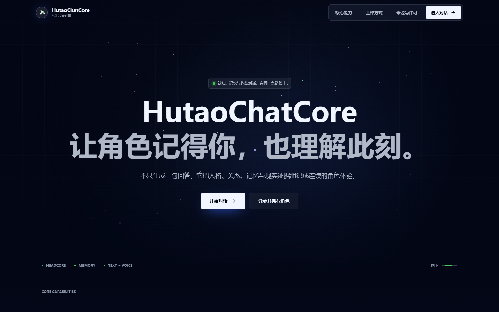
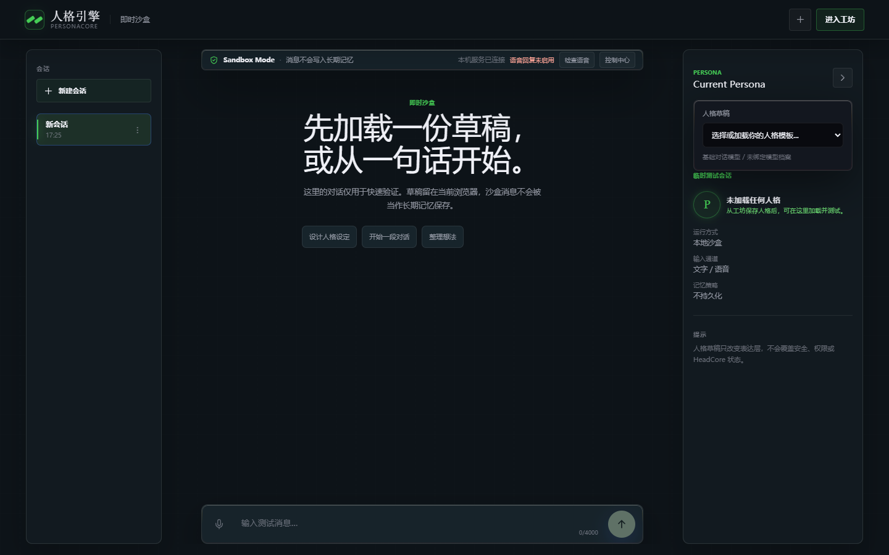
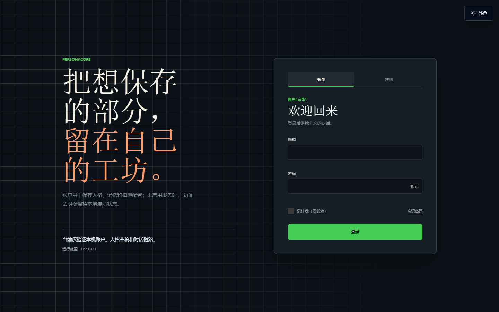
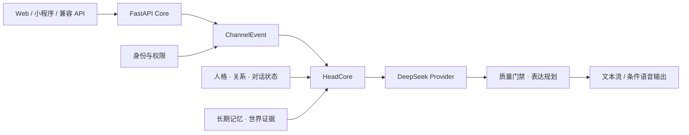

<div align="center">
  <h1>HutaoChatCore</h1>
  <p><strong>让角色记得你，也理解此刻。</strong></p>
  <p>围绕 HeadCore 构建的本地优先角色陪伴系统，将人格、关系、记忆、现实证据与回复质量控制放进同一条对话链路。</p>
  <p>
    <code>Python 3.11</code>
    <code>FastAPI</code>
    <code>React 19</code>
    <code>PostgreSQL / MySQL</code>
    <code>DeepSeek</code>
  </p>
  <p>
    <a href="#界面预览">界面预览</a> ·
    <a href="#核心链路">核心链路</a> ·
    <a href="#快速开始">快速开始</a> ·
    <a href="#交付边界">交付边界</a> ·
    <a href="#验证状态">验证状态</a>
  </p>
</div>



> [!IMPORTANT]
> 当前版本用于本机开发和毕业设计验收，默认仅监听 `127.0.0.1:8000`，尚未部署到公网。仓库不包含模型权重、真实语音、账号数据、运行日志或任何密钥。

## 这是什么

HutaoChatCore 不是把聊天页面直接接到大模型的转发壳。每条消息会先进入统一事件协议，再由 HeadCore 组织人格、关系、当前场景、短期脉络、长期记忆和现实证据，最后经过回复评估与表达规划。

| 连续角色对话 | 可审计记忆 | 条件语音链路 | 现实证据 |
| --- | --- | --- | --- |
| 人格、关系和对话状态共同参与生成 | 记忆可查询、撤销、过期并按账号隔离 | 支持文件/流式识别和可选本地 TTS | 天气、地点、路线、新闻、政策与搜索采用受限工具协议 |

## 界面预览

<table>
  <tr>
    <td width="62%">
      
    </td>
    <td width="38%">
      
    </td>
  </tr>
  <tr>
    <td>
      <strong>Web Desk</strong><br>
      会话、流式回复、人格草稿和能力状态集中在同一个工作区。截图使用无账号、无消息的隔离本地实例。
    </td>
    <td>
      <strong>账户入口</strong><br>
      登录、注册、邮箱验证与密码重置共用同一入口；实际开放范围由服务端能力状态决定。
    </td>
  </tr>
</table>

截图生成于 2026-08-30，来自当前工作区运行页面。未使用视觉工作台，也未写入真实用户内容。

## 核心链路



- **统一入口**：Web、API 和微信小程序消息先规范为 `ChannelEvent`，再进入同一运行时。
- **状态分层**：人格、关系、短期上下文、长期记忆与世界事实分别管理，不混成一段不可审计的提示词。
- **流式优先**：文本支持 SSE 流式输出，并设置首字节、总耗时和中断预算。
- **失败显式化**：外部 Provider、语音、数据库和世界工具未配置时返回真实状态，不伪造成功结果。
- **安全门禁**：身份一致性、关系越界、自伤诱导、虚构经历和撤销记忆等规则在服务端执行。

## 交付边界

| 状态 | 当前范围 |
| --- | --- |
| 可直接运行 | 官网、Web Desk 本地沙盒、文本/SSE 接口、JSONL 存储、本机控制中心、OpenAI-Compatible 文本接口 |
| 配置后可用 | DeepSeek 真实回复、PostgreSQL 或 MySQL V2 账号体系、SMTP、FunASR/SenseVoice、GPT-SoVITS、Qdrant、地图/天气/新闻/搜索 |
| 实验性 | Windows 桌面配置页、人格版本持久化写入、知识候选自动摄取 |
| 已封存 | 摄像头采集、视觉工作台和聊天视觉上下文；它们不在当前运行时或 README 展示范围内 |
| 尚未完成 | 公网安全闭环、多实例共享限流、备份恢复演练、代码解释器、电脑控制、支付订阅 |

“测试通过”只说明仓库内确定性场景没有回归，不代表另一台机器已经具备外部模型、邮件、数据库或语音服务。

## 快速开始

### Windows PowerShell

```powershell
git clone https://github.com/DyQcml12/HeadCore.git
Set-Location HeadCore

py -3.11 -m venv .venv
.\.venv\Scripts\Activate.ps1
python -m pip install --upgrade pip
python -m pip install -r requirements.txt

Copy-Item .env.example .env
python -m app.main
```

在本机 `.env` 中填写实际需要的配置。调用真实文本模型至少需要 `DEEPSEEK_API_KEY`；不要把真实值写回 `.env.example` 或提交到 Git。

启动后访问：

| 页面 | 地址 |
| --- | --- |
| 项目官网 | `http://127.0.0.1:8000/` |
| 对话工作区 | `http://127.0.0.1:8000/desk` |
| 账号与个人中心 | `http://127.0.0.1:8000/auth`、`/me` |
| 本机控制中心 | `http://127.0.0.1:8000/control` |
| 健康检查 | `http://127.0.0.1:8000/health` |

<details>
<summary>Linux / macOS 启动命令</summary>

```bash
git clone https://github.com/DyQcml12/HeadCore.git
cd HeadCore

python3.11 -m venv .venv
source .venv/bin/activate
python -m pip install --upgrade pip
python -m pip install -r requirements.txt

cp .env.example .env
python -m app.main
```

</details>

> `requirements.txt` 当前仍包含本地 ASR、音频和语义模型依赖，安装体积较大；项目尚未拆分轻量 Web 依赖组。

## 配置方式

`.env.example` 是无秘密的完整配置模板。所有外部能力默认关闭或进行依赖检查，推荐一次只启用一组：

| 目标 | 主要配置 | 详细说明 |
| --- | --- | --- |
| 仅本机文本对话 | `DEEPSEEK_API_KEY` | 保持 JSONL、认证关闭和 `127.0.0.1` 绑定 |
| Web 账号与持久化 | PostgreSQL 或 MySQL V2，二选一作为身份主库 | 先迁移独立数据库，再启用认证开关 |
| 注册与密码重置 | Web 账号 + SMTP | 邮件能力未就绪时注册与重置保持关闭 |
| 本地语音 | FunASR/SenseVoice；语音回复另需 GPT-SoVITS 服务 | 模型和本地服务不随仓库分发 |
| 世界工具与搜索 | 对应 Provider Key、来源开关和法律审核开关 | 未配置来源时明确返回不可用状态 |

PostgreSQL 与 MySQL V2 不是两个可随意并行的账号系统。启用公开认证时，启动校验会要求明确且唯一的 Web 身份主库。

## API 摘要

| 方法 | 路径 | 用途 |
| --- | --- | --- |
| `POST` | `/api/v1/chat/stream` | SSE 流式文本对话 |
| `POST` | `/api/v1/chat` | 非流式文本或音频对话 |
| `POST` | `/api/v1/audio/transcribe/file` | 文件语音识别 |
| `WS` | `/api/v1/audio/transcribe/stream` | 流式语音识别 |
| `GET` | `/api/v1/chat/history` | 当前身份的会话历史 |
| `GET` | `/api/v1/memories` | 当前身份的记忆档案 |
| `GET` | `/api/v1/capabilities` | 前端使用的真实能力状态 |
| `POST` | `/v1/chat/completions` | OpenAI-Compatible 文本接口 |

兼容接口只接受文本内容。图片与音频会明确拒绝；摄像头和视觉上下文没有接入当前对话主线。

## 验证状态

2026-08-30 当前工作区的离线验收结果：

| 检查 | 结果 |
| --- | --- |
| Python 全量测试 | `975 passed, 6 skipped` |
| 微信小程序测试 | `5 passed` |
| React/Vite 生产构建 | 通过 |
| 世界模型固定集 | `12 / 12` |
| 反事实评估 | `4 / 4` |
| 效果分层评估 | `PASS 12 / 12, L2` |

```powershell
python -m compileall -q app scripts tests
python -m pytest tests -q -p no:cacheprovider
node --test miniprogram/tests/api-client.test.js miniprogram/tests/session.test.js
npm.cmd --prefix frontend/site run build
```

真实 DeepSeek、SMTP、数据库和语音服务不包含在普通离线通过率中；只有准备好这些服务时才运行带 live 选项的验收。

## 项目结构

```text
HutaoChatCore/
├── app/                 # FastAPI、HeadCore、业务模块与静态 Web 页面
├── frontend/site/       # React/Vite 官网
├── miniprogram/         # 原生微信小程序
├── migrations/          # PostgreSQL 与 MySQL V2 迁移
├── scripts/             # 迁移、检查、评估与运维脚本
├── tests/               # 项目自动化测试
└── .env.example         # 无秘密的完整配置模板
```

## 公网边界

当前服务不能直接绑定 `0.0.0.0` 后暴露到互联网。公网开放前至少还需要 HTTPS、可信反向代理、严格 Host/CORS 策略、多实例共享限流、验证码或等价滥用防护、邮件日额度、数据库备份恢复演练、密钥轮换、审计留存和独立安全测试。

`/control` 默认仅允许回环访问；启用 Web 认证后还需命中管理员邮箱白名单。生产环境必须关闭或隔离 `/control`、`/app`、`/docs`、`/openapi.json` 和兼容 API。

## 许可说明

仓库当前未附开源许可证。项目代码、角色素材、语音权重和第三方模型的授权边界不同；未经明确许可，不要复制分发模型或角色资产。第三方前端资源与许可信息可在本地 `/credits` 页面查看。
