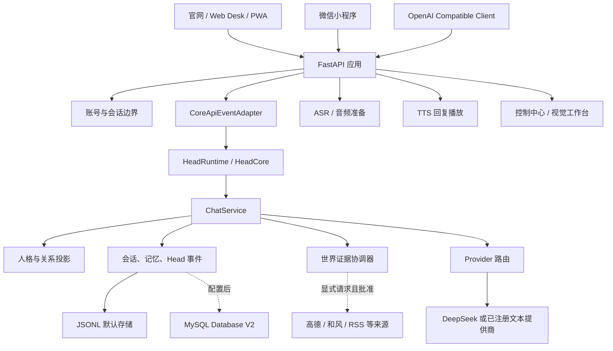
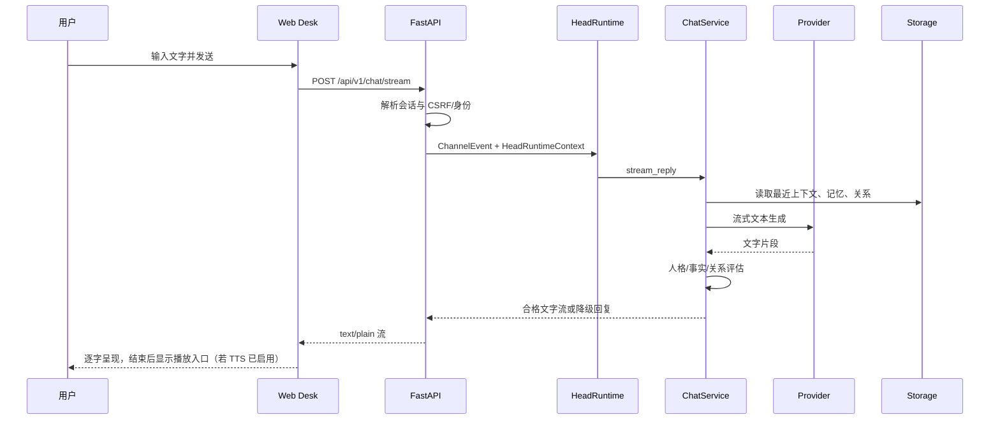
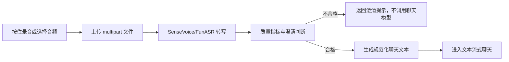
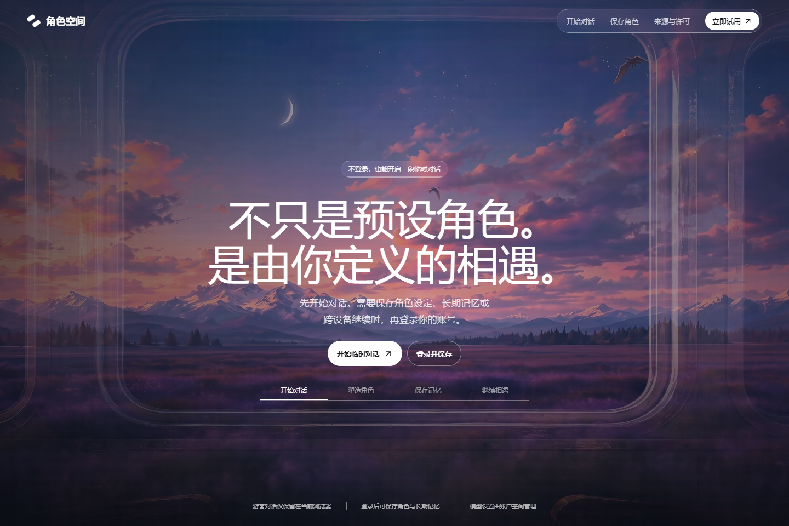
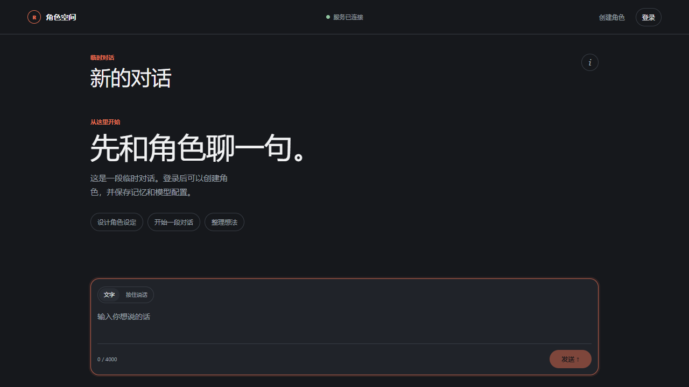
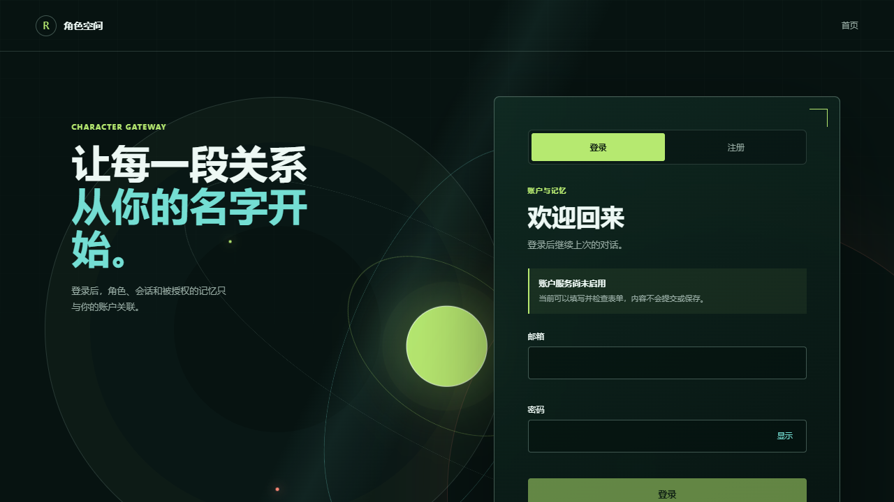
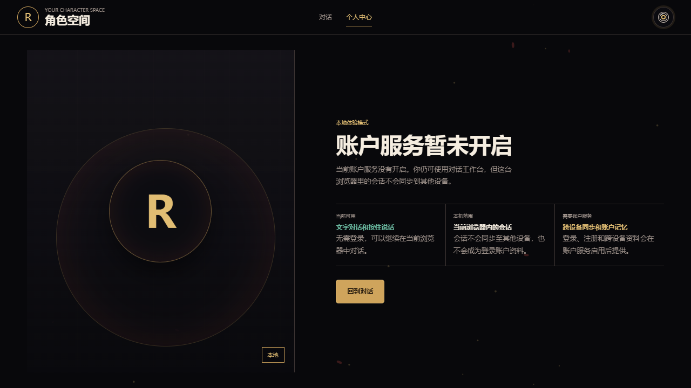
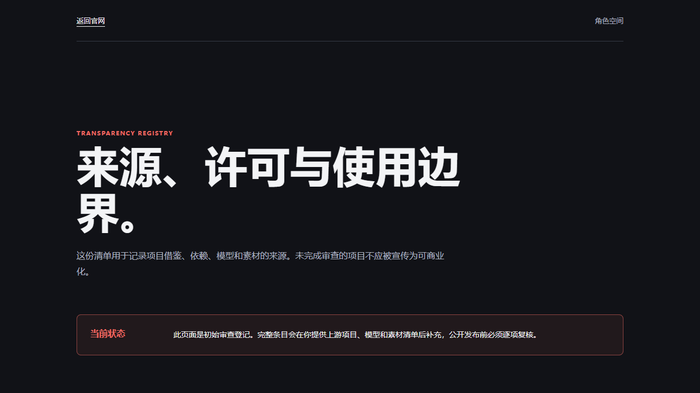
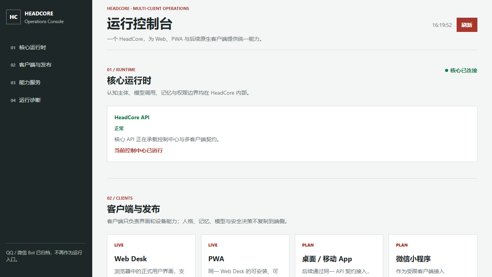
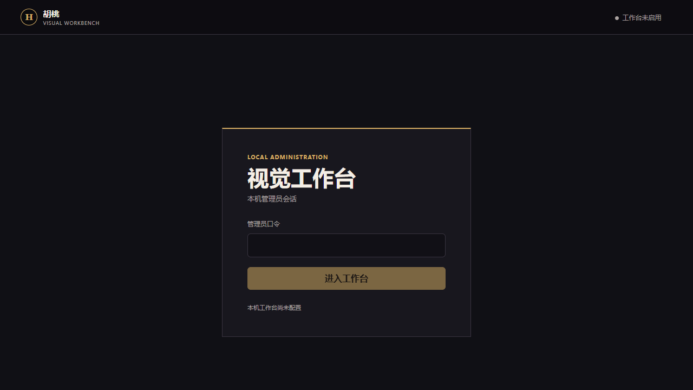

# HutaoChatCore 当前全栈架构、功能与界面说明

> 更新时间：2026-08-02  
> 依据：当前仓库源码、`.env.example`、现有自动化测试、运行在本机 `127.0.0.1:8019` 的页面快照。  
> 目的：说明“当前代码实际提供什么”，而非把规划、训练实验或旧页面当成已发布能力。

## 目录

1. [阅读方式与状态标记](#1-阅读方式与状态标记)
2. [产品边界与全局架构](#2-产品边界与全局架构)
3. [工程目录与职责](#3-工程目录与职责)
4. [框架、依赖、模型与外部工具](#4-框架依赖模型与外部工具)
5. [HeadCore 与聊天后端](#5-headcore-与聊天后端)
6. [功能调用链](#6-功能调用链)
7. [HTTP、WebSocket 与页面接口](#7-httpwebsocket-与页面接口)
8. [数据、记忆、身份与安全边界](#8-数据记忆身份与安全边界)
9. [网页页面逐页说明与截图](#9-网页页面逐页说明与截图)
10. [小程序、桌宠与游戏陪伴边界](#10-小程序桌宠与游戏陪伴边界)
11. [配置、启动与验证](#11-配置启动与验证)
12. [当前完成度与下一步](#12-当前完成度与下一步)

## 1. 阅读方式与状态标记

| 标记 | 含义 |
| --- | --- |
| 已实现 | 当前代码中有入口、实现和对应数据契约。是否在线仍取决于运行配置。 |
| 配置后可用 | 代码与接口存在，但必须配置数据库、第三方服务、模型或管理员密钥。 |
| 默认关闭 | 出于成本、隐私、法律或安全原因，模板配置默认关闭。 |
| 训练/实验 | 有训练材料、模型文件或评估代码，不等于已接到生产运行链路。 |
| 规划 | 仅是产品方向或目录预留，不应对用户宣传为现有功能。 |

本文不记录任何真实 API Key、密码、Cookie、Token、账户 ID、邮箱或实际 `.env` 内容。所有开关均引用 `.env.example` 的字段名。

## 2. 产品边界与全局架构

### 2.1 当前产品定位

HutaoChatCore 的后端核心是 **HeadCore**：它是唯一的认知主体和业务编排边界。网页、PWA、微信小程序、音频、视觉、世界工具以及未来本地桌宠都是输入/输出终端，不能各自复制另一套人格、记忆或权限判断。

当前内置运行时人格仍为 `hutao_v1`。但官网已使用“角色空间”作为面向用户的产品文案，强调用户先进行临时对话，再在账户能力开放后保存角色、记忆和模型配置。内部工程名与对外品牌不是同一概念。

### 2.2 系统总图



### 2.3 不属于当前公开产品的内容

- 桌宠、Live2D/VTS 模型和 Minecraft 游戏陪伴尚未接入当前 FastAPI 公开产品链路。
- QQ、微信目录和历史素材仍在仓库中，但当前 `app/main.py` 不再挂载 QQ/微信 Web 页面或平台运行路由；不能把它们写成当前公开入口。
- 向量数据库、Embedding 检索和 RAG 向量记忆**尚未接入当前运行时**。MySQL 不是向量数据库；当前长期信息以结构化/文本记录为主。
- CosyVoice2 训练资产属于训练与评估范围，并不代表当前 QQ 或网页 TTS 已由 CosyVoice2 稳定驱动。

## 3. 工程目录与职责

| 路径 | 职责 | 运行性质 |
| --- | --- | --- |
| `app/` | FastAPI、HeadCore、认证、音频、记忆、世界工具、视觉和静态页面路由 | 当前核心 |
| `app/static/web/site/` | React/Vite 官网构建产物 | 当前公开官网 |
| `frontend/site/` | 官网 React 19 源码与 Vite 构建配置 | 当前前端源码 |
| `app/static/web/studio/` | Web Desk 对话工作台、PWA 清单和 Service Worker | 当前公开工作台 |
| `app/static/auth/` | 登录、注册、验证与找回密码的前端壳 | 当前页面，能力受后端开关约束 |
| `app/static/profile/` | 个人中心与记忆管理前端 | 当前页面，账户能力受开关约束 |
| `app/static/web/credits/` | 第三方项目、模型和许可展示页 | 当前公开页面 |
| `app/static/control/` | HeadCore 运维控制台 UI | 管理用途 |
| `app/static/workbench/` | 本地视觉工作台 UI | 默认关闭、管理员用途 |
| `app/head/` | 事件、状态、决策、计划、情景记忆、世界状态与运行时投影 | 认知编排层 |
| `app/mind/` | 自我状态、社交状态、会话状态 | HeadCore 的状态子层 |
| `app/services/chat_service.py` | 提示词组装、Provider 路由、评估、降级、审计和持久化 | 核心聊天服务 |
| `app/storage/` | JSONL 仓储及 Database V2 选择逻辑 | 默认 JSONL |
| `app/auth/` | 登录、会话、CSRF、移动端 Bearer 会话与账户 API | 配置后启用 |
| `app/audio/` | 文件上传、ASR、情绪、质量门、流式音频会话 | 当前接口存在 |
| `app/voice_chat/` | GPT-SoVITS 适配、网页 TTS 短时回复存储 | 网页播放默认关闭 |
| `app/camera/`、`app/workbench/` | 本地相机控制、稳定观察和管理员工作台 | 默认关闭 |
| `app/world/` | 工具决策、来源目录、缓存、证据上下文、冲突处理 | 需显式授权与来源批准 |
| `app/persona_management/` | 人格版本、发布、绑定及运行时投影 | 持久化需 MySQL V2 |
| `miniprogram/` | 原生微信小程序：对话、个人中心、认证三页 | 独立客户端，需 HTTPS 后端 |
| `migrations/v2/` | Database V2 / 公开账户能力的数据库迁移 | 部署前操作 |
| `external/` | GPT-SoVITS、Mailpit、指针和桌宠模型等外部软件/素材 | 外部依赖，不等于服务已启用 |
| `tests/` | Python 自动化测试 | 当前回归保障 |
| `docs/` | 架构、验收、世界工具、网页和训练说明 | 文档来源 |

## 4. 框架、依赖、模型与外部工具

### 4.1 Web 与服务框架

| 分类 | 组件 | 版本/来源 | 在项目中的作用 |
| --- | --- | --- | --- |
| 后端框架 | FastAPI | `fastapi==0.124.2` | 路由、响应模型、上传、流式响应、静态文件托管。 |
| ASGI 服务 | Uvicorn | `uvicorn==0.38.0` | 运行本地 FastAPI 应用。 |
| HTTP 客户端 | HTTPX | `httpx==0.28.1` | 调用模型/外部来源及测试 ASGI 应用。 |
| 前端框架 | React 19 | `react`、`react-dom` | 官网首屏与交互状态。 |
| 前端构建 | Vite 6 | `vite`、`@vitejs/plugin-react` | 将 `frontend/site` 编译到 `app/static/web/site`。 |
| 动画 | Motion | `motion` | 官网入场、菜单、场景切换等有状态动效。 |
| 图标 | Lucide React | `lucide-react` | 官网图标，不手绘 SVG。 |
| PWA | Web App Manifest + Service Worker | `app/static/web/studio/` | Web Desk 的可安装和离线启动外壳。 |
| 小程序 | 微信原生小程序 | `miniprogram/` | 使用小程序平台 UI 与 HTTPS API，不依赖微信云开发。 |
| 测试 | Pytest | `pytest==9.0.3` | Python 后端、页面静态入口和功能回归。 |
| 浏览器验收 | Playwright CLI + Edge | 本次文档截图使用 | 实际加载本机页面并截屏。 |

### 4.2 模型、服务与状态

| 能力 | 代码/工具 | 当前状态 | 说明 |
| --- | --- | --- | --- |
| 文本生成 | DeepSeek Provider，`app/providers/deepseek.py` | 配置后可用 | 默认模板选择 `MODEL_PROVIDER=deepseek`；密钥只应放在 `.env`。Provider 失败时由本地降级回复兜底。 |
| 文本接口兼容 | OpenAI Compatible Router | 已实现 | 对外提供兼容客户端入口，仍进入同一 HeadCore，不创建第二人格。 |
| 语音识别 | FunASR / SenseVoice Small | 已实现，模型需就绪 | `ASR_FILE_PRESETS=sensevoice-small`；上传后先转写，再进入质量门。 |
| 语音情绪 | emotion2vec 路径 | 已实现 | 作为转写观察字段，不能被当作对用户心理状态的确定性结论。 |
| 网页 TTS | GPT-SoVITS 服务适配 | 代码存在，网页默认关闭 | 网页只允许对服务器已登记的短时 `reply_id` 合成，不能由浏览器任意提交文本。 |
| OCR | RapidOCR + ONNX Runtime | 视觉依赖可选 | 处理本地视觉文字观察；本身不等于语义理解。 |
| 姿态/人脸关键点 | MediaPipe | 默认允许安装，功能关闭 | 相机工作台开启后才使用；`CAMERA_FACE_IDENTIFICATION_ENABLED=false`。 |
| 目标检测 | Ultralytics / YOLO | 可选，需模型路径 | `CAMERA_YOLO_MODEL_PATH` 为空时不可宣称启用。 |
| 本地专业视觉 | YOLO、MediaPipe、RapidOCR | 默认关闭 | 只输出允许标签；不调用 Ollama/Qwen 或通用 VLM。 |
| 世界工具 | 高德、和风天气、RSS/API 候选来源 | 默认关闭或需批准 | 只响应显式问题；来源、法律批准、缓存和冲突检测均有独立门。 |

### 4.3 外部目录的正确理解

`external/GPT-SoVITS-v2pro-20250604` 是可单独运行/训练的语音框架；`external/genshin胡桃live2dex` 与 `external/genshin胡桃vts` 是桌宠素材；`external/mailpit-windows-amd64` 是本地邮件测试工具。它们放在仓库中不表示 FastAPI 启动后会自动加载、下载、执行或对公网暴露。

## 5. HeadCore 与聊天后端

### 5.1 唯一认知入口

`HeadRuntime` 接收统一的 `ChannelEvent` 和 `HeadRuntimeContext`，只处理消息事件。它将来源、会话、用户、输入方式、ASR 质量、情绪观察和可选回复风格传给 `ChatService`。这让网页文本、网页语音、未来小程序和兼容 API 进入同一认知链路。

### 5.2 HeadCore 内部组成

| 子模块 | 主要文件 | 职责 |
| --- | --- | --- |
| 事件与契约 | `head/events.py`、`head/contracts.py` | 统一事件、主题、会话和状态输入。 |
| 自我/社交/会话状态 | `mind/self_state.py`、`mind/social_state.py`、`mind/conversation_state.py` | 保存有限的状态投影，用于回复风格和边界，而非另一个语言模型。 |
| 决策与计划 | `head/decision.py`、`planning.py`、`long_term_planning.py` | 形成下一步、待问问题、活动任务和不确定性。 |
| 情景与长期记录 | `episodic_memory.py`、`cognitive_facts.py`、`world_model_store.py` | 记录可回溯事件和经允许的事实。 |
| 人格与关系 | `persona/`、`persona_management/`、`mind/social_state.py` | 人格提示词、版本投影、关系边界和身份守卫。 |
| 表达与评估 | `expression/`、`head/evaluation.py` | 清洗模型文本，检测人格泄漏、关系越界、虚构世界事实和过长回复。 |
| 世界事实 | `head/world_evidence.py`、`head/world_state.py` | 只把经工具验证的事实投影到当前回答。 |

### 5.3 ChatService 的责任

`app/services/chat_service.py` 是业务编排层，而不是单纯调用大模型的函数：

1. 读取会话、最近消息、记忆、关系与人格投影。
2. 对用户输入和音频质量建立 `PreparedChat` 上下文。
3. 仅在用户明确请求时，让世界工具协调器准备有来源、有效期和冲突状态的证据。
4. 通过 Provider Router 选择具有文本能力的提供商；非流式与流式路径均经过同一保护规则。
5. 对模型回复执行本地人格/世界事实/关系边界评估；失败时尝试受限修复或返回本地保守回复。
6. 保存消息、模型调用摘要、人格评估、Head 事件和脱敏审计元数据。

### 5.4 不是“有自我意识”的含义

HeadCore 有状态、计划、记忆、关系边界和事实验证机制，因此能跨轮保持一致性；但它不是意识实体，也不能宣称拥有主观体验、现实生活经历或未验证的实时知识。系统必须将模型输出、工具证据、用户陈述和内部状态清晰区分。

## 6. 功能调用链

### 6.1 文本对话



关键实现：Desk 使用 `POST /api/v1/chat/stream`，通过 `ReadableStream` 渲染增量文本；等待状态只是“正在组织回复”，不会伪造模型思考内容或不断累加计时器。临时访客会话可在浏览器内存在；当公开认证真正启用时，服务端会忽略/拒绝伪造的网页平台身份字段。

### 6.2 语音输入与质量门



- `/api/v1/audio/transcribe/file`：只做文件转写。
- `/api/v1/audio/chat/prepare/file`：用于 Desk 的两阶段流程，返回原始转写、规范化文本、质量原因和是否应澄清。
- `/api/v1/audio/chat/file`：一体化上传、转写、质量门和聊天回复接口。
- 音频输入的流式回答受 `VOICE_CHAT_REPLY_TIMEOUT_SECONDS` 约束，超时返回明确的重试提示，避免无限等待。

### 6.3 网页 TTS 回复播放

1. 文本回复完成后，只有在 `PUBLIC_WEB_TTS_ENABLED=true` 且公开认证已生效时，服务器才生成短期 `reply_id`。
2. Desk 把该 ID 发送到 `POST /api/v1/voice/synthesize`，并携带同源 Cookie 与 CSRF 头。
3. 服务端验证会话、速率、长度、并发和 ID 所属关系；调用 GPT-SoVITS/Bert-VITS2 适配器。
4. 音频只在项目内短时目录中生成，响应结束后通过后台任务清理。

因此，前端没有“让用户随意提交一段文本就合成任意音色”的接口。用户自训练音色产品应当作为独立、授权和审核后的训练/发布流程设计，不能绕过这条服务端边界。

### 6.4 记忆与长期上下文

当前系统区分以下层次：

| 层次 | 当前来源 | 用途 | 现状 |
| --- | --- | --- | --- |
| 当前输入 | 请求体 / 音频准备结果 | 本轮意图和质量信息 | 已实现 |
| 短期会话 | 最近消息窗口 | 保持当前话题与上下文 | 已实现 |
| Head 事件 | `head/events.py` | 任务、待问问题、状态投影 | 已实现 |
| 结构化记忆 | JSONL / MySQL V2 仓储 | 记忆列表、删除、关系和模型调用记录 | JSONL 默认可用；MySQL V2 配置后可用 |
| 人格/知识投影 | 人格、知识模块 | 在提示词中提供受控背景 | 部分依赖持久化开关 |
| 向量检索 | 无 | 相似语义召回 | 当前未实现 |

`GET /api/v1/memories` 和 `DELETE /api/v1/memories/{memory_id}` 已有后端契约。个人中心只有在公开认证与数据库能力满足时才应展示真实账户数据；否则保持明确的受限状态。

### 6.5 认证与账户

```mermaid
flowchart TD
    AuthPage[/auth 页面] --> Status[GET /api/v1/auth/status]
    Status --> Off{认证服务启用?}
    Off -->|否| Disabled[表单显示不可用原因，不伪装注册成功]
    Off -->|是| Login[POST /api/v1/auth/login]
    Login --> Cookie[短时 HttpOnly 会话 Cookie]
    Cookie --> Desk[Desk / 个人中心同源请求]
    Cookie --> CSRF[写操作校验 X-CSRF-Token]
    Mobile[小程序] --> MobileLogin[POST /api/v1/auth/mobile/login]
    MobileLogin --> Bearer[短时 Bearer 会话]
```

认证、注册、邮箱验证和密码重置不是“只要前端有表单即可”。它们要求至少同时满足公开认证、Database V2、MySQL 连接；注册/验证/重置还要求邮件投递配置。密码只保存哈希；成功重置会撤销该账户既有会话。

### 6.6 世界工具与事实约束

世界工具不是学习型“世界模型”。它是一个有来源、缓存、权限和冲突状态的证据编排层：

1. `WorldBrainCoordinator` 先识别用户是否提出明确的天气、路线、新闻或政策请求。
2. 普通提及、推测、无地点天气问题和用户拒绝调用都不会访问外部来源。
3. 请求通过来源注册表、法律批准、启用开关、HTTPS 主机白名单、超时和缓存限制。
4. 结果经上下文裁剪、过期过滤和冲突检测后才进入当轮提示词。
5. 无来源、来源冲突、需要地点确认或服务不可用时，系统返回确定性说明，而不是让模型编造实时答案。

### 6.7 本地视觉与工作台

视觉能力仅属于管理员受控工作台，不属于 `/desk`：

- `VISUAL_WORKBENCH_ENABLED` 默认关闭。
- 管理员通过独立口令建立短时 `HttpOnly` 会话，写操作使用 CSRF 校验。
- 相机会话要求显式同意；默认不持久化原始帧，`CAMERA_RAW_FRAME_RETENTION_SECONDS=0`。
- 默认禁止人脸身份识别和云端上传。
- 视觉输出使用稳定确认、允许标签和 TTL；当前仅使用本地专用视觉组件，不调用 Ollama/Qwen 或通用 VLM。

## 7. HTTP、WebSocket 与页面接口

### 7.1 用户侧页面与接口

| 页面/接口 | 方法 | 用途 | 认证/状态 |
| --- | --- | --- | --- |
| `/` | GET | React 官网 | 公开 |
| `/desk` | GET | Web Desk / PWA 工作台 | 访客可进入；账户能力依配置 |
| `/auth` | GET | 登录、注册、验证、找回密码前端壳 | 公开；提交能力依配置 |
| `/me` | GET | 个人中心、账户和记忆 | 页面公开，账户数据依认证 |
| `/credits` | GET | 第三方来源与许可清单 | 公开 |
| `/api/v1/chat` | POST | 非流式文字聊天 | 同源会话/CSRF 规则 |
| `/api/v1/chat/stream` | POST | 流式文字聊天 | 同源会话/CSRF 规则 |
| `/api/v1/audio/transcribe/file` | POST | 音频文件转写 | 文件上传接口 |
| `/api/v1/audio/chat/prepare/file` | POST | ASR + 质量门 + 待发送文本 | 同源会话/CSRF 规则 |
| `/api/v1/audio/chat/file` | POST | 一体化音频聊天 | 同源会话/CSRF 规则 |
| `/api/v1/voice/status` | GET | 网页 TTS 的非敏感可用状态 | 公开状态 |
| `/api/v1/voice/synthesize` | POST | 以服务器登记的 `reply_id` 播放回复 | 认证、CSRF、速率与短时 ID |
| `/api/v1/memories` | GET | 读取当前用户记忆 | 认证边界 |
| `/api/v1/memories/{memory_id}` | DELETE | 删除当前用户一条记忆 | 认证、CSRF、用户隔离 |
| `/api/v1/dialogue-context` | GET | 当前活动任务/待答问题投影 | 认证边界 |
| `/api/v1/auth/*` | 多种 | 登录、移动登录、账户信息、登出等 | 依认证运行时启用 |
| `/v1/*` | 多种 | OpenAI Compatible API | 进入同一 HeadCore |

### 7.2 管理与受控接口

| 页面/接口 | 作用 | 边界 |
| --- | --- | --- |
| `/control` | 服务、能力状态、测试报告与脱敏诊断 | 运维控制台，不是普通用户 Desk。 |
| `/api/control/*` | 控制配置、服务、测试、日志摘要 | 管理用途；隐藏按钮不等于后端授权。 |
| `/workbench` | 本地视觉工作台 | 默认关闭，需独立管理员口令。 |
| `/api/workbench/*` | 登录、会话、相机与观察状态 | 管理员 Cookie、CSRF、显式同意。 |
| `/api/control/camera/*` | 相机控制底层接口 | 不应暴露到公开用户页面。 |

## 8. 数据、记忆、身份与安全边界

### 8.1 存储策略

| 模式 | 开关/前置条件 | 数据边界 |
| --- | --- | --- |
| JSONL | `STORAGE_BACKEND=jsonl` | 默认开发存储；适合本地连续性与离线测试。 |
| MySQL Database V2 | `DATABASE_V2_ENABLED=true`，并具备 MySQL 配置与迁移 | 账户、跨端、人格持久化和管理能力的前置条件。 |
| 向量数据库 | 当前无接入 | 未来若做语义记忆，应独立设计 Embedding、召回、删除、版本、权限和成本，不可把 MySQL 字段误称为向量检索。 |

### 8.2 安全设计要点

- 密钥只在 `.env`，不进前端、截图、日志、README 或文档。
- 公共网页登录使用 `HttpOnly` Cookie；写操作有 CSRF 校验。
- 小程序使用短时 Bearer 会话，不复用网页 Cookie 语义。
- 记忆删除和读取以经过认证的 profile ID 为准，不能相信客户端提供的任意 `user_id`。
- 网页 TTS 的文本来源受服务器回复 ID 限制，避免把合成接口变成开放滥用点。
- 世界工具不通过 IP 推断位置，不擅自访问未批准来源。
- 相机默认不上传原始帧、不做身份识别，且对捕获会话有时间上限和显式同意要求。

## 9. 网页页面逐页说明与截图

### 9.1 截图范围

以下截图均为 2026-08-02 在本机 `http://127.0.0.1:8019`、`1440 × 960` 浏览器视口的真实页面。截图未发送聊天消息、未录音、未调用模型、未登录管理员工作台。FastAPI 自动生成的 `/docs`、纯 API `/health` 和静态资源 URL 不视为产品页面；未挂载的 QQ/微信历史页面不纳入“当前页面”。

### 9.2 官网 `/`

**职责**：解释角色空间的产品逻辑，允许游客直接进入临时对话；登录只用于后续保存能力。  
**设计结构**：四层全屏视频场景、透明叠图、阅读遮罩、液态玻璃导航、场景切换、移动端全屏菜单和 `prefers-reduced-motion` 降动效。  
**主要出口**：`/desk`、`/auth`、`/credits`。



### 9.3 对话工作台 `/desk`

**职责**：普通用户的对话入口，不是运维面板。  
**已实现交互**：文字流式回复、IME 安全 Enter 发送、Shift+Enter 换行、音频文件/按住录音的两阶段转写、回复状态、按需 TTS 播放入口、临时会话和账户状态判断。  
**明确不包含**：控制中心链接、配置、日志、摄像头、QQ 窗口捕获、世界工具原始状态和管理 API 调用。



### 9.4 认证页面 `/auth`

**职责**：承载登录、注册、邮箱验证、密码重置和新密码设置的 UI 状态。  
**真实边界**：页面存在不等于认证后端已启用。前端先读取 `/api/v1/auth/status`；当公开认证、数据库或邮件条件不满足时，表单应保持明确的不可用状态，不伪造提交成功。



### 9.5 个人中心 `/me`

**职责**：展示当前账户、记忆列表、记忆删除和退出登录。  
**后端依赖**：`/api/v1/auth/status`、`/api/v1/auth/me`、`/api/v1/memories`、删除接口与登出接口。  
**状态设计**：未认证或认证能力关闭时，页面显示门禁状态；不把浏览器临时 ID 伪装成正式账号。



### 9.6 来源与许可 `/credits`

**职责**：从 `credits/data.json` 读取来源条目，按状态展示第三方项目、模型、素材和许可边界。  
**产品意义**：项目含有多种参考和外部模型时，应把来源、许可、用途和非商业/审核限制公开到此页，而不是在官网文案中掩盖。



### 9.7 管理控制台 `/control`

**职责**：只读聚合 HeadCore 运行状态、客户端发布状态、能力服务、诊断、测试报告和脱敏错误分类。  
**设计边界**：与 Desk 完全分离；页面可见不等于允许执行任何高权限动作，所有控制 API 仍需服务端授权。  
**注意**：截图中的服务状态是当时本机快照，不能当作长期在线承诺。



### 9.8 本地视觉工作台 `/workbench`

**职责**：管理员在本机明确同意后创建相机会话、查看捕获和观察状态。  
**当前状态**：默认关闭；截图显示未配置状态，输入和进入按钮都不可用。  
**本次验证记录**：加载未启用页时浏览器控制台出现 1 条错误，应在启用视觉工作台前单独定位和修复；本文件不将其记为“通过”。



### 9.9 响应式设计原则

| 终端 | 官网 | Desk | 认证/个人中心 |
| --- | --- | --- | --- |
| PC | 视频全屏、横向玻璃导航、底部状态信息 | 大屏聊天画布 | 表单与信息面板并列/分区 |
| 平板 | 保留全屏场景，缩减导航与字号 | 单主任务区，减少同时可见的辅助区 | 表单宽度受控，避免横向滚动 |
| 手机 | 汉堡菜单、两行标题、按钮自适应、无横向滚动 | 触控录音与输入优先 | 页面状态优先，表单字段保持可读 |

## 10. 小程序、桌宠与游戏陪伴边界

### 10.1 微信小程序

小程序工程已经包含 `pages/chat/index`、`pages/profile/index` 和 `pages/auth/index`。它只能调用公开用户能力：账户、文本聊天、按住录音上传、回复播放、记忆和对话脉络。正式部署必须使用备案后的 HTTPS 域名和微信后台白名单；`127.0.0.1`、`localhost` 和 IP 不能作为正式小程序服务域名。

### 10.2 桌宠

桌宠模型素材在 `external/`，但桌宠应用尚未是当前工程的已运行客户端。将来应当以独立本地产品接入：本地 ASR、低频桌面观察、TTS、经过确认的电脑控制；不复制 HeadCore 的云端人格和记忆实现，也不把屏幕/摄像头采集加入公开网页。

### 10.3 Minecraft 游戏陪伴

当前没有 Minecraft 自动化、游戏注入、机器人进服或屏幕控制实现。若后续开发，应选择“本地客户端 + 明确游戏适配层”的架构，独立处理游戏版本、玩家同意、控制权限、资源上限与服务器规则；它不是本次 Web 后端功能的一部分。

## 11. 配置、启动与验证

### 11.1 关键开关

| 功能 | 主要字段 | 安全结论 |
| --- | --- | --- |
| 文本模型 | `MODEL_PROVIDER`、`MODEL_NAME`、`MODEL_BASE_URL`、密钥字段 | 有有效提供商后才使用在线模型。 |
| Database V2 | `DATABASE_V2_ENABLED`、`MYSQL_*` | 迁移和隔离验收完成前不应打开写入。 |
| 公开认证 | `PUBLIC_WEB_AUTH_ENABLED` | 需要数据库；注册/重置还需要邮件能力。 |
| 网页 TTS | `PUBLIC_WEB_TTS_ENABLED`、Provider、Base URL | 必须与公开认证和真实模型验收同时满足。 |
| 世界工具 | `WORLD_AWARENESS_ENABLED`、来源/法律批准字段 | 默认关闭，按来源逐项批准。 |
| 相机/视觉 | `VISUAL_WORKBENCH_ENABLED`、`CAMERA_*` | 默认关闭，独立管理员会话和显式同意。 |

### 11.2 本地启动

```powershell
cd D:\Programming-file\Graduation-Project\HutaoChatCore
& 'D:\Tool\Progrmming-Tool\anaconda\envs\new\python.exe' -m uvicorn app.main:app --host 127.0.0.1 --port 8000
```

官网源码有变更时：

```powershell
cd D:\Programming-file\Graduation-Project\HutaoChatCore\frontend\site
npm.cmd run build
```

### 11.3 建议验证顺序

1. `compileall` 检查 Python 导入。
2. 运行 `python -m pytest tests -q -p no:cacheprovider`。
3. 打开 `/`、`/desk`、`/auth`、`/me`、`/credits`，检查无横向溢出、无重叠、导航和表单状态正确。
4. 认证、MySQL、TTS、世界 API、相机分别在隔离配置和真实凭据下做独立验收；自动化测试不能替代真实外部服务验收。
5. 在启用视觉工作台前，先处理本文件记录的未启用页控制台错误。

## 12. 当前完成度与下一步

### 12.1 当前可用于演示的闭环

- 官网到临时 Web Desk 的导航闭环。
- 文本流式聊天 API 与 HeadCore 编排链路。
- 音频上传、转写、质量门和进入文本聊天的链路。
- 来源与许可展示。
- 控制台的只读状态与诊断视图。
- JSONL 默认存储路径与记忆接口契约。

### 12.2 需要配置或专项验收后才能对外承诺的能力

- 公开注册、登录、跨设备账户和密码重置。
- MySQL Database V2、人格版本持久化与用户可保存角色。
- 网页 TTS 的真实音色、延迟、成本和并发验收。
- 高德、和风天气、新闻和政策来源的逐项法律/密钥/在线验收。
- 本地视觉工作台、摄像头和经独立验收的专用视觉组件。
- 小程序正式 HTTPS 域名、审核、会话与媒体联调。

### 12.3 后续文档维护规则

每次功能变更应同时更新：本文件的状态矩阵、受影响的调用链、对应页面截图、`.env.example` 注释、测试说明和 `/credits` 来源清单。任何“已上线”“已可用”“已接入模型”的表述，都必须有当前运行配置和独立验收记录支撑。
