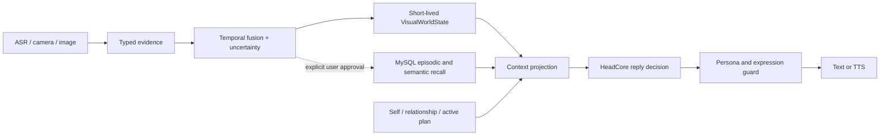

# Local-First Visual World State And Backend Design

## Scope And Honest Boundary

HeadCore is a controllable agent system. The engineering objective is observable continuity: a stable persona, relationship-aware behavior, explicit plans, approved memories, and evidence-backed perception. It is not an AGI and no test can prove that it has consciousness, feelings, or human-equivalent thought.

This document supersedes the former Ollama/Qwen image route. The current backend does not call a generative VLM, does not require Ollama, and never uploads camera frames. QQ image reading remains metadata/OCR only; the camera runtime emits only bounded local detector labels.

The existing camera foundation is sound: explicit consent, owner-bound session TTL, no raw-frame persistence, no face identification, typed `CameraObservation`, allowlisted labels, temporal confirmation, and attention-gated context injection. It cannot honestly provide arbitrary image descriptions, identity recognition, private intent inference, or a person's true emotion.

## One Authority For Memory

There must not be two authoritative memory databases.

| Data | Authority | Derived copy | Retention |
| --- | --- | --- | --- |
| Accounts, relations, conversations, approved episodic memories, plans and self state | MySQL | Optional caches | Product policy |
| Embeddings | None | Qdrant retrieval index only | Rebuild from MySQL |
| Camera/video frames | None | None | Process memory only |
| Confirmed visual state | Process memory now, Redis in multi-worker mode | Prompt projection | 15 seconds by default |
| User-approved visual memory | MySQL with evidence and consent | Qdrant when searchable | Product policy |

MySQL commits the source memory and an outbox event in one transaction. The indexer consumes the event idempotently into Qdrant. An index outage may reduce recall, but must never lose or invent memory; a full rebuild reads MySQL. This is a single-source-of-truth design, not a double write.

The project currently defaults to JSONL and keeps MySQL/Qdrant off. That is acceptable for local development, not a multi-user server. Before public deployment, promote MySQL to the durable source of truth, prove migration/restore/outbox recovery in isolation, and move ephemeral `VisualWorldState` to Redis.

## Cognitive Flow

`VisualWorldState` is perception, not long-term memory. A fact contains source model/version, timestamp, random session-local track ID, confidence, expiry, and evidence. It expires on session stop or absence. Raw frames, untrusted OCR text, identity data, and free-form detector responses must not become prompt instructions.

An internal response plan can improve consistency, but private model chain-of-thought must not be exposed or represented as evidence of consciousness. Test the resulting behavior and its cited inputs instead.

## Specialist Local Visual Stack

Run a dedicated local `vision-worker` process. It receives a bounded stream of decoded frames over loopback/IPC and emits typed evidence. It never calls the chat model.

| Requirement | Local specialist component | Output admitted to HeadCore |
| --- | --- | --- |
| Objects and scene evidence | YOLO11n or YOLOv8n ONNX, ONNX Runtime | allowlisted box/class/score |
| Multi-frame continuity | ByteTrack | random session-local track ID only |
| Body posture | MediaPipe Pose Landmarker or MoveNet Lightning | landmark-derived posture/motion feature |
| Hand gesture | MediaPipe Gesture Recognizer | fixed gesture vocabulary and score |
| Facial expression cue | MediaPipe Face Landmarker, optional small ONNX classifier | non-identifying cue probability only |
| Visible text | RapidOCR or PaddleOCR | bounded text and OCR confidence |
| Short action sequence | MoViNet-A0 TFLite/ONNX after benchmark | fixed activity label and temporal score |

These are professional specialized models, not a local large language or visual-language model. Pin weight version and SHA-256, review model license/data provenance, keep a rollback copy, and load weights only in the worker. Do not download weights on a user request.

Do not turn facial expression into a claim about true emotion. The maximum safe result is a cue such as `brow_furrow_probability=0.72`; HeadCore must phrase it as uncertain context, never as diagnosis. A fixed-model stack cannot replace a VLM for arbitrary picture narration. Until a separately approved capability exists, OCR must say it can read text but cannot reliably identify an unseen object.

## Temporal Fusion And World State

1. Timestamp, resize, and enqueue a frame; drop excess frames rather than build latency.
2. Run object, pose, hand, face-cue and OCR paths at independently benchmarked rates.
3. Attach model/version/score/frame time/local tracker ID to every evidence item.
4. Confirm a fact repeatedly in a sliding window. The current camera default is two observations in eight seconds.
5. Fuse by recency and score into `VisualWorldState`, then emit `appeared`, `updated`, and `disappeared` changes.
6. Project only user-relevant, unexpired, high-confidence facts into HeadCore.
7. Persist only an explicitly user-approved summary with provenance when it is genuinely useful.

The first useful world model is therefore a state estimator, not a trained universal simulator. A later predictive layer may produce narrow, testable hypotheses such as “the tracked cup moved from desk to hand.” It must declare horizon and confidence, be evaluated on held-out video, and never be presented as general human-like world understanding.

## Deployment

For one PC, Core and `vision-worker` share loopback only. For a multi-user server, isolate the worker on authenticated internal networking, retain short-lived state in Redis, and keep durable state in MySQL. A future desktop app captures locally after local consent and sends only typed evidence to Core; it does not upload raw camera/video simply because a server exists.

## Latency And Acceptance

The following are targets, not measurements from this machine. Hardware, resolution, drivers, and pinned weights determine actual latency.

| Path | Acceptance target (p50 / p95) | Current measured result |
| --- | --- | --- |
| 640px object detection on approved GPU | <= 50 ms / <= 100 ms | Not measured: no approved YOLO weight configured |
| Pose and gesture | <= 45 ms / <= 90 ms | Not measured: camera runtime disabled |
| OCR still image | <= 300 ms / <= 800 ms | Not measured end-to-end in this run |
| Visual state availability | capture interval + confirmation window | Configured 2 s and 2/8 s; not live measured |
| SenseVoice ASR | corpus acceptance | Previous CUDA regression: 28/28 pass; fresh microphone latency still requires corpus run |
| TTS first audio / full reply | <= 1.5 s / <= 5 s | Not measured: local endpoints unavailable |

Benchmark the target hardware using a consented fixed video corpus and fixed audio corpus. Record p50/p95/p99 latency, throughput, CPU/GPU RAM, frame drops, detector precision/recall, OCR character error rate, ASR error rate, TTS first-audio time, and blinded human scores for voice naturalness and persona consistency. Unit tests prove contracts and fallbacks, not human-quality perception or speech.

## What Can Be Claimed

Tests can establish that a reply used current self/relationship/plan context, a memory came from the authoritative store, a visual fact expired, or a persona guard rejected a violation. They cannot establish consciousness. The defensible product goal is a reliable companion with consistent, transparent behavior.
