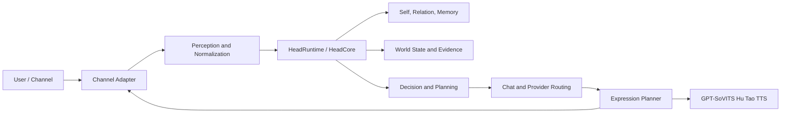

# HutaoChatCore Technical Architecture Reference

## 1. Purpose and Boundaries

HutaoChatCore is a Hu Tao character-agent backend. Its central boundary is
**HeadCore**: one cognitive subject shared by QQ, Weixin, and HTTP. Channels,
models, databases, world APIs, ASR, vision, and TTS are replaceable input or
expression systems. They must not create a second persona, memory, or decision
process.

`hutao_v1` is the only active runtime persona. The system is designed to make
its replies more coherent and context-aware; it does not claim consciousness,
free internal thought, or a complete learned world model.

## 2. Runtime Architecture



### Core responsibilities

| Layer | Main modules | Responsibility | Important constraint |
| --- | --- | --- | --- |
| Channel | `app/channels` | Normalizes platform messages and emits platform-safe responses | Platform identity is not a persona |
| Perception | `app/perception`, `app/audio` | Creates bounded observations with confidence and source | Untrusted content cannot become fact directly |
| HeadCore | `app/head` | Builds cognitive state, selects actions, tracks plans and feedback | The only cognitive subject |
| Persona and relation | `app/persona`, `app/mind`, `app/database_control` | Hu Tao identity, tone, relationship and permission rules | `hutao_v1` only |
| Memory and facts | `app/storage`, `app/knowledge`, `app/head/cognitive_facts.py` | JSONL/MySQL storage, trusted facts, expiry and revocation | A model assertion is not evidence |
| World | `app/world`, `app/head/world_model.py` | Evidence, entity/relation/event graph, causal hypotheses | Unknown or unapproved sources stay unavailable |
| Language and expression | `app/services`, `app/providers`, `app/expression` | LLM execution, provider routing, output projection | No provider may bypass HeadCore |
| Voice | `app/voice_chat`, GPT-SoVITS | Renders approved text to audio | TTS has no memory or decision authority |
| Operations | `app/control`, `scripts` | Service launch, health, logs, tests and acceptance | Health is not production acceptance |

## 3. Cognitive and World Logic

For each turn, `HeadRuntime` constructs `HeadState` from identity, relation,
conversation, memory, observations, current plans, and world evidence. It then
selects a bounded `HeadDecision` such as answer, clarify, continue, repair,
support, or refuse. The language model writes the response after this decision,
not before it.

The current world model is an engineering state model rather than a learned
physical simulator. `HeadWorldModel` stores entities, time-limited relations,
events, and causal hypotheses. `CognitiveFact` records source, confidence,
validity, revision and revocation. Expired and conflicted facts are excluded
from confirmed context and are instead projected as bounded uncertainty signals,
without exposing their values. This avoids treating stale API data, prompt
content, or LLM guesses as current facts.

A higher trusted fact version for the same key supersedes lower versions while
retaining them for audit. A lower-confidence newer value cannot silently replace
a higher-confidence old value: both remain conflicted until later evidence
resolves them. Different values also conflict when they share the same current
highest version.

World events remain in the auditable graph, but events older than the default
30-day context window are excluded from current prompt projection and produce a
bounded stale-event signal. This prevents historical operational events from
being presented as current state.

The world-evidence converter currently accepts only public current-weather
observations with confidence of at least 0.80. It writes only allowlisted
condition, temperature, and humidity fields with source and expiry metadata;
precise location, IP location, routes, news and free-form source content are
not automatically persisted.

The result is a traceable observe -> interpret -> decide -> plan -> execute ->
feedback -> revise loop. It improves consistency, but it is not evidence that
the system thinks like a human in the scientific sense.

## 4. Voice Architecture

The active provider is local GPT-SoVITS v2ProPlus:

| Item | Value |
| --- | --- |
| API | `http://127.0.0.1:9880/tts` |
| GPT checkpoint | `GPT_weights_v2ProPlus/hutao-e15.ckpt` |
| SoVITS checkpoint | `SoVITS_weights_v2ProPlus/hutao_e8_s912.pth` |
| Default reference audio | `logs/hutao/5-wav32k/127.wav_0000000000_0000122560.wav` |
| Default speed factor | `0.93` |
| Stable sampling | `top_k=15`, `top_p=0.85`, `temperature=0.70`, `repetition_penalty=1.20` |

The flow is: HeadCore-approved text -> voice planner segmentation -> local
GPT-SoVITS request -> WAV validation -> FFmpeg MP3 conversion -> signed web
reply audio. The old `ellie_Bert-VITS2` directory was removed and is not part
of the current runtime.

Start the local voice API from the project root:

```powershell
external\GPT-SoVITS-v2pro-20250604\runtime\python.exe external\GPT-SoVITS-v2pro-20250604\api_v2.py -a 127.0.0.1 -p 9880 -c external\GPT-SoVITS-v2pro-20250604\GPT_SoVITS\configs\tts_infer.yaml
```

Then run the repeatable acceptance:

```powershell
D:\Tool\Progrmming-Tool\anaconda\envs\new\python.exe scripts\gpt_sovits_acceptance.py
```

## 5. Operations and Acceptance

Run automated project regression:

```powershell
D:\Tool\Progrmming-Tool\anaconda\envs\new\python.exe -m pytest tests -q -p no:cacheprovider
```

Automated tests prove contracts, deterministic logic, and local integration.
They do not prove natural voice quality, persona likeness, platform delivery,
external API accuracy, or production database safety. Those require separate
human/listening and live-service acceptance.

## 6. Current Delivery Status

Implemented and regression-tested: HeadCore cognitive pipeline, Hu Tao persona
routing, relationship and memory controls, cognitive facts, world graph and
plans, world evidence boundaries, GPT-SoVITS local integration, control-center
service health, and automated regression tests.

Requires live acceptance or configuration: MySQL V2 persistence, PostgreSQL web
accounts, Amap with a user-provided key, legally approved news sources, live
ASR/emotion quality, and extended human review of Hu Tao persona and voice
samples.

Long-term plan steps cannot be completed by a model claim. In addition to test,
tool, and explicit user-confirmation evidence, a trusted executor can now bind
an active step to named world events. Such events must be explicitly selected,
no older than 30 days, non-future, and at least 0.80 confidence.

## 7. Safety Rules

- Do not put secrets in source, logs, reports, or model prompts.
- Do not infer user location from IP without explicit consent.
- Do not fetch disabled or unapproved world sources.
- Do not present model-generated claims as verified world facts.
- Do not let TTS, platform adapters, or external tools alter persona memory or
  HeadCore decisions directly.
