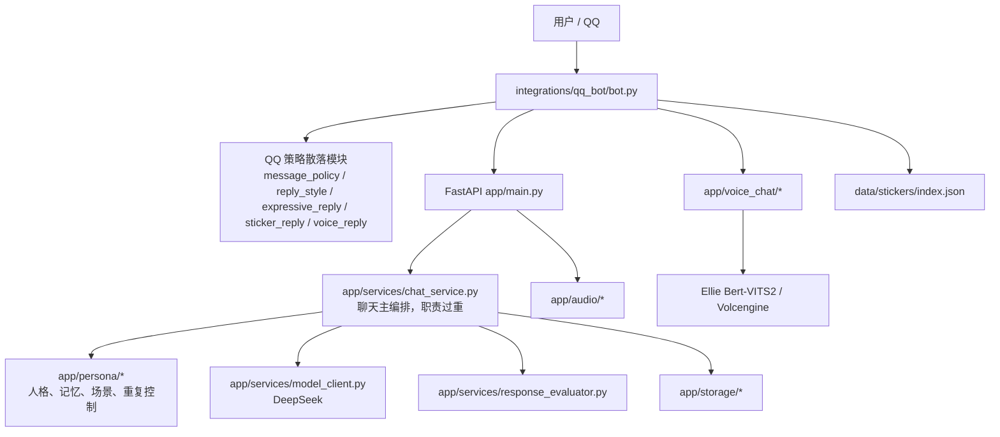
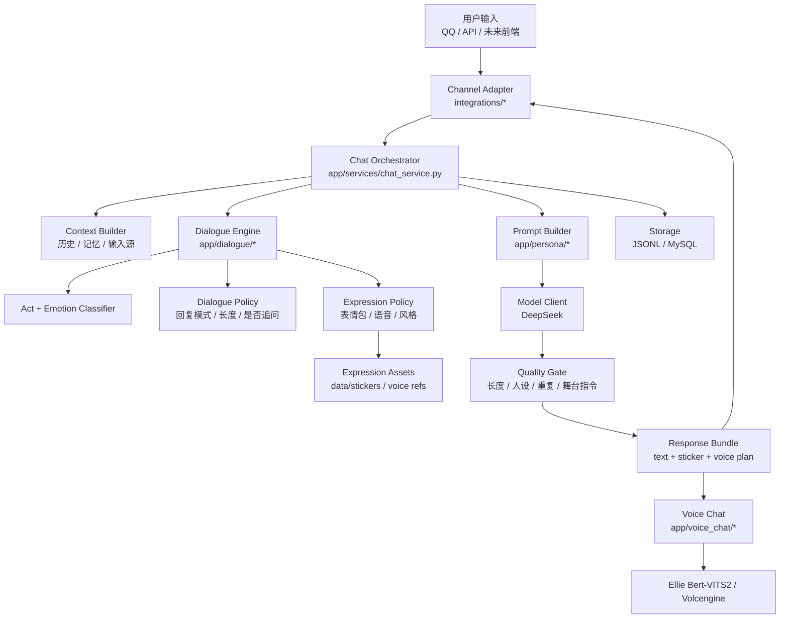
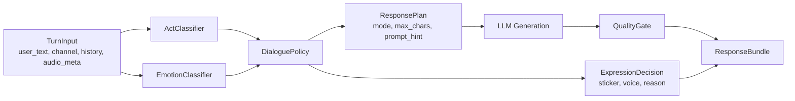

# HutaoChatCore 架构重设计方案

日期：2026-07-02

本文档是开发前方案，不是已执行重构。所有代码移动、删除、改名都需要你确认后再做。

## 目标

- 在原 `HutaoChatCore` 项目内整理，不创建新的项目文件夹。
- 把聊天策略、表情包、语音、QQ 通道从当前散落状态收口。
- 保留现有可运行能力，避免大规模一次性重写。
- 每个阶段都能单测、记录 Markdown、更新 `AGENTS.md` 和 `README.md`。

## 当前架构



主要问题：

- `chat_service.py` 承担编排、提示词、上下文、记忆、评估、回退等太多职责。
- QQ 的正常聊天策略、表情包策略、语音策略目前在 `integrations/qq_bot/` 内，不利于未来复用到前端或其他通道。
- `scripts/` 没有区分运行、训练、数据、smoke、评测。
- `tests/test_app.py` 单文件过大。
- 生成产物和源数据没有完全分开。

## 新架构方案



核心变化：

- `app/dialogue/` 成为正常聊天策略中心。
- `integrations/qq_bot/` 只保留 QQ 适配：收消息、发文字、发图、发语音、处理撤回。
- 表情包和语音由统一表达策略输出，不再各自随机。
- 质量门统一控制文本过长、重复、舞台指令、客服腔。

## 建议目录结构

```text
HutaoChatCore/
  app/
    api/
    core/
    services/
      chat_service.py
      model_client.py
      model_audit.py
    dialogue/
      __init__.py
      types.py
      act_classifier.py
      emotion_classifier.py
      policy.py
      response_style.py
      expression_policy.py
      quality_gate.py
    persona/
      persona_prompt_builder.py
      hutao_rules.py
      memory_policy.py
      memory_service.py
      relationship_context.py
      repetition_policy.py
      scene_classifier.py
      turn_taking.py
    expression/
      __init__.py
      sticker_catalog.py
      sticker_selector.py
      voice_decision.py
    audio/
    voice_chat/
    storage/
  integrations/
    qq_bot/
      bot.py
      config.py
      hutao_client.py
      message_policy.py
      recall_guard.py
  scripts/
    runtime/
    smoke/
    dataset/
    training/
    eval/
    maintenance/
  data/
    stickers/
    hutao_voice/
    generated_voice/
    models/
  artifacts/
    build/
    voice_smoke/
    reports/
  docs/
    architecture/
    operations/
    voice/
    qq/
  tests/
    fixtures/
    test_chat_api.py
    test_dialogue_policy.py
    test_qq_bot.py
    test_qq_sticker.py
    test_qq_voice.py
    test_audio_pipeline.py
```

说明：

- `app/dialogue/`：负责“这一轮应该怎么聊”。
- `app/expression/`：负责表情包和语音这类输出资产选择，后续可从 QQ 复用到前端。
- `integrations/qq_bot/`：只做 QQ 通道，不承载核心聊天算法。
- `artifacts/`：放生成物，避免污染 `data/` 源数据。
- `scripts/`：先不直接移动，后续分批迁移。

## Dialogue Engine 设计



建议类型：

```text
TurnInput
- user_text
- channel
- history_summary
- relationship_state
- audio_emotion
- is_group

DialogueDecision
- dialogue_act
- emotion
- response_mode
- max_chars
- should_ask_followup
- prompt_instruction

ExpressionDecision
- sticker_intent
- sticker_allowed
- voice_allowed
- voice_style
- reason

ResponseBundle
- text
- sticker
- voice
- audit
```

## 分阶段迁移

### 阶段 1：只加 Dialogue Policy，不动大结构

范围：

- 新增 `app/dialogue/`。
- 把 QQ 短回复、技术语境禁表情、表情意图判断抽象成可测试策略。
- `integrations/qq_bot/` 继续调用旧入口，但内部转调新策略。

验证：

- `tests/test_dialogue_policy.py`
- 旧 QQ sticker/voice/short reply 测试继续通过。

风险：低。

### 阶段 2：拆测试文件

范围：

- 拆分 `tests/test_app.py`。
- 不改业务逻辑。

验证：

- 全量 pytest。

风险：低到中。

### 阶段 3：整理表情包与语音表达层

范围：

- 新增 `app/expression/`。
- 将 `sticker_reply.py` 的索引读取和选择逻辑迁移到 `app/expression/`。
- QQ 只负责 `MessageSegment.image()` 和发送。

验证：

- 表情包选择单测。
- QQ 本地 smoke。

风险：中。

### 阶段 4：整理 scripts

范围：

- 新建 `scripts/runtime`、`scripts/smoke`、`scripts/dataset`、`scripts/training`、`scripts/eval`。
- 先保留旧路径包装器，避免 README 命令全部失效。

验证：

- 启动器 `--check-only`。
- 关键 smoke。

风险：中。

### 阶段 5：生成物归档

范围：

- 新建 `artifacts/`。
- 迁移 `build/` 和历史 voice smoke 输出。
- 增加 `.gitignore`。

验证：

- QQ 启动器仍可找到根目录 EXE。
- 语音路径不受影响。

风险：中，需要你确认保留哪些样本。

## 不建议做的事

- 不要一次性移动所有脚本。
- 不要删除 logs。
- 不要把 prompt、人格、表情包、语音全部塞进一个大策略文件。
- 不要依赖纯随机控制表情包和语音。

## 需要你确认的问题

1. 是否同意先做阶段 1：新增 `app/dialogue/`，把正常聊天策略收口？
2. 是否同意后续把 `tests/test_app.py` 拆成多个测试文件？
3. 是否允许后续清理本项目内 `__pycache__`、`.pytest_cache`、`build/qq_launcher`？
4. `data/hutao_voice/tests/` 的历史 WAV 样本是否要全部保留，还是只保留最近 PASS 样本？
