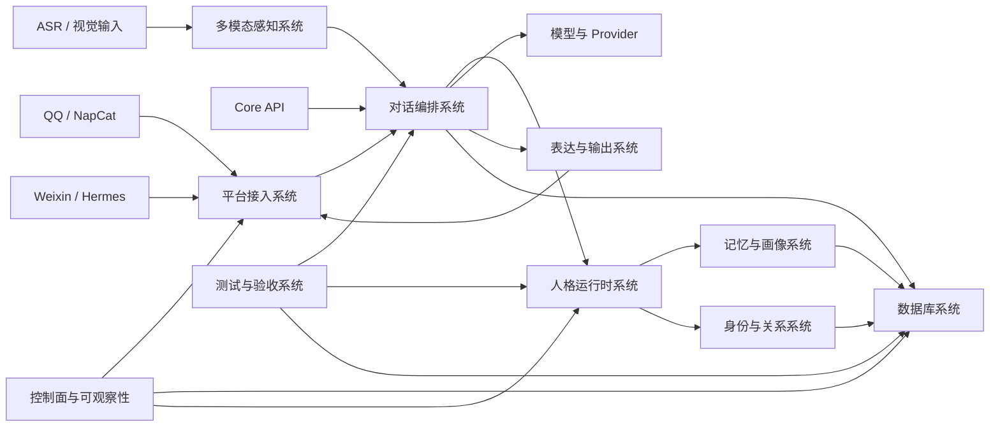

# HutaoChatCore 项目系统化审计

日期：2026-07-14

## 结论

HutaoChatCore 已经不是单一聊天程序，而是由多个领域能力组成的虚拟伴侣平台原型。当前最需要的不是继续增加零散功能，而是把已存在的模块收敛为有明确输入、输出、状态和验收标准的子系统。

可直接分配给不同开发者的独立任务文档位于 `docs/systems/`，总分工与合并规则见 `docs/systems/README.md`。

项目当前可以归纳为九个系统，其中三个基本成形、五个部分成形、一个仍主要停留在设计阶段。

| 系统 | 当前状态 | 主要边界 |
| --- | --- | --- |
| 对话编排系统 | 已实现 | ChatService、模型调用、fallback、质量门禁 |
| 人格运行时系统 | 已实现核心 | profile、动态状态、关系 overlay、response gate |
| 测试与验收系统 | 已实现 | pytest、smoke、连续性与最终验收报告 |
| 身份与关系系统 | 部分实现 | V1 命令可用，V2 repository 完成，控制 API 未完成 |
| 记忆与画像系统 | 部分实现 | 记忆读写可用，统一生命周期、画像审批和撤销审计不足 |
| 多模态感知系统 | 部分实现 | 文件 ASR 可用，视觉 provider 存在，实时 ASR/VLM 运行条件不足 |
| 表达与输出系统 | 部分实现 | 文本、表情包、Ellie/火山 TTS |
| 平台接入系统 | 部分实现 | QQ adapter 较完整，Weixin 主要依赖 Hermes OpenAI-compatible 接口 |
| 数据库控制面系统 | 设计为主 | V2 schema/repository 有实现，HTTP API 和管理页面未实现 |

## 当前系统关系



## 还能设计成系统的部分

### 1. 数据库控制面系统

优先级：P0。

现有 `DATABASE_SYSTEM_DESIGN.md` 和 `DATABASE_BACKEND_API_DESIGN.md` 已提供数据模型与目标 API，但当前 FastAPI 没有 `/api/control/database-v2/*` 路由。

建议系统边界：

- 输入：已解析的管理员 actor、分页/筛选参数、受控修改命令。
- 核心：profile、账号绑定、关系、画像、记忆、人格 binding 服务。
- 输出：脱敏 DTO、审计事件、明确错误码。
- 不负责：模型生成、平台事件解析、直接拼 SQL 的页面逻辑。

完成标准：新版迁移通过、唯一管理员绑定、API 鉴权、路由测试、控制页面和审计日志全部通过。

### 2. 统一平台事件系统

优先级：P1。

QQ 已有项目内 adapter，Weixin 主要通过 Hermes 的 OpenAI-compatible 文本入口，能力不对称。建议定义统一 `ChannelEvent` 和 `ChannelResponse`：

- 平台身份、会话、消息、附件、撤回、引用、群聊元数据统一结构化。
- QQ/Weixin adapter 只负责协议转换和发送。
- 权限、人格、记忆和安全策略只依赖统一事件，不直接依赖 OneBot/Hermes 字段。
- 平台能力通过 capability matrix 暴露，避免调用不存在的语音或资料接口。

### 3. 多模态感知系统

优先级：P1。

当前音频、OCR、Ollama VLM 和附件摘要分散。建议统一为 `PerceptionObservation`：

- 输入：音频、图片、附件元数据和来源质量。
- 输出：文本、情绪、视觉观察、置信度、provider、错误与降级原因。
- 质量门：低质量内容不写长期记忆，不直接形成事实。
- provider 可替换：FunASR、OCR、Ollama 或未来远程 VLM。

当前阻塞：Ollama 服务在线但没有注册模型；实时麦克风 ASR 仍未实现。

### 4. 记忆与画像生命周期系统

优先级：P1。

目前已有记忆规则、撤销和 Database V2 画像设计，但缺少统一生命周期。建议明确：

```text
candidate -> reviewed/auto-approved -> active -> superseded/revoked -> deleted
```

系统应负责来源追踪、置信度、可见范围、冲突合并、过期、撤销传播和管理员审计。人格 prompt 只能读取投影结果，不能直接修改 profile。

### 5. 人格管理控制面

优先级：P2。

运行时六层人格核心已实现，但当前只有代码内 `xiaohe_v1`。未来若需要多人格，应独立设计：

- typed profile registry 与版本发布；
- profile/state/relationship/surface 分层配置；
- conversation/profile/platform/global binding 优先级；
- 草稿、验证、发布、回滚；
- persona gate 不允许关闭系统级安全规则。

在只有一个稳定人格时，不应提前建设复杂可视化编辑器。

### 6. 模型与 Provider 路由系统

优先级：P2。

当前 DeepSeek、Ollama、FunASR、Ellie、火山 TTS 分别配置。可统一 provider 状态、超时、重试、fallback、熔断和成本/延迟审计，但不要把不同模态硬塞进同一个调用接口。

建议公共能力：健康状态、模型清单、超时、错误分类、请求审计、降级原因；模态专属请求仍保留 typed protocol。

### 7. 表达计划系统

优先级：P2。

现有文本、语音、表情包已有策略，可统一输出 `ResponseBundle`：文本、语音计划、表情计划、平台降级策略。它只决定表达形式，不重新决定人格、权限或事实。

### 8. 控制面与可观察性系统

优先级：P2。

控制中心已有服务、配置、日志和测试入口。可继续统一：

- 服务健康与依赖图；
- 非敏感配置状态；
- provider/model readiness；
- 数据库迁移/readiness；
- 最近失败与测试报告索引；
- 操作审计和管理员权限。

控制面不能返回密钥、完整 prompt、私密记忆或平台 token。

## 不建议独立成系统的内容

- 单个 prompt 文件：属于人格系统内部实现。
- 某一个模型目录：属于 provider 或训练资产，不是业务系统。
- 单个 QQ 命令：属于身份关系或平台 adapter 的用例。
- 表情包索引：属于表达系统资产。
- 日志目录：属于可观察性产物，不应成为业务源数据。

## 推荐实施顺序

1. 完成 Database V2 新库迁移、管理员 bootstrap 和 readiness。
2. 实现 Database V2 最小只读 API：status、admin、profiles、profile detail。
3. 建立统一平台事件 DTO，先适配 QQ，再补 Weixin 项目内事件入口。
4. 建立统一多模态观察 DTO，将 ASR、视觉和附件摘要接入质量门。
5. 收敛记忆与画像生命周期，补撤销、冲突和审计测试。
6. 最后再做人格管理 UI、provider 路由和表达计划控制面。

## 本次验收基线

- 全量测试：351 passed。
- 最终项目验收：PASS，3/3 required steps。
- MySQL V1 smoke：PASS，真实写入会话、消息、模型调用和人格评估。
- Database V2 readiness：FAIL，原因是新版 schema 尚未应用且没有管理员 bootstrap。
- 已知非阻塞警告：Windows 拒绝 pytest 写 `.pytest_cache`，不影响测试结果。
