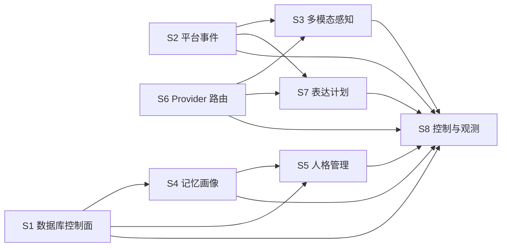

# HutaoChatCore 并行系统开发总览

统一项目架构、依赖、启动、运维、能力矩阵和最终验收门槛见
[`../HUTAOCHATCORE_COMPLETE_ARCHITECTURE_AND_ACCEPTANCE_MANUAL.md`](../HUTAOCHATCORE_COMPLETE_ARCHITECTURE_AND_ACCEPTANCE_MANUAL.md)。

状态：S1-S8 设计基线已完成集成，但 2026-07-16 运行验收仍为 `degraded`。是否完成以统一架构文档的当前能力矩阵、本文“整体完成门”与各系统完成标准共同判定。

## 分配表

| 编号 | 系统 | 文档 | 建议负责人 | 依赖 |
| --- | --- | --- | --- | --- |
| S1 | Database V2 控制面 | `01-database-control-plane.md` | 数据库后端 | 现有 V2 repository |
| S2 | 统一平台事件 | `02-channel-event-system.md` | 平台接入 | 无，先定义契约 |
| S3 | 多模态感知 | `03-multimodal-perception-system.md` | 音频/视觉 | S2 事件附件契约 |
| S4 | 记忆与画像生命周期 | `04-memory-portrait-lifecycle.md` | 记忆/数据库 | S1 repository 边界 |
| S5 | 人格管理控制面 | `05-persona-management-system.md` | 人格系统 | S1、S4 |
| S6 | Provider 路由 | `06-provider-routing-system.md` | 模型基础设施 | 无 |
| S7 | 表达计划 | `07-expression-planning-system.md` | TTS/表达 | S2、S6 |
| S8 | 控制面与可观察性 | `08-control-observability-system.md` | 控制中心 | 读取 S1-S7 状态 |

## 并行开发规则

每位开发者只修改自己文档中“独占写入范围”列出的目录。下列共享文件默认冻结：

- `app/main.py`
- `app/services/chat_service.py`
- `app/core/config.py`
- `app/control/routes.py`
- `integrations/qq_bot/bot.py`
- `.env`、`.env.example`
- `requirements.txt`
- `migrations/v2/*`
- `README.md`、`AGENTS.md`

需要共享文件变更时，开发者只提交一份 `integration-notes.md`，由集成人员统一修改。不得在多个分支分别编辑共享文件。

## 契约优先

开发顺序统一为：

1. 在系统自己的 `contracts.py` 或 `models.py` 中定义 typed contract。
2. 写 contract/service 单元测试。
3. 实现系统内部逻辑和内存 fake。
4. 提交集成说明，不直接接入 ChatService 或 FastAPI 根路由。
5. 集成人员按依赖顺序连接系统。

跨系统只能依赖公开 contract，不允许导入对方的 repository 私有方法、UI 内部状态或测试 helper。

## 集成后唯一运行时主链路

```text
平台原始事件
  -> S2 ChannelEvent
  -> 身份解析与权限（S1）
  -> 附件感知（S3，经 S6 路由）
  -> 记忆候选与只读投影（S4）
  -> 人格运行时投影（S5）
  -> ChatService / 模型调用（S6）
  -> ResponseBundle（S7）
  -> S2 平台投递 adapter
  -> S8 状态、trace 与审计投影
```

集成入口负责组装依赖，不承载领域规则。S1 是身份、权限和持久化 readiness 的权威来源；S4 只向 prompt 暴露脱敏投影；S5 只向运行时暴露已发布人格投影；S8 只读取公开状态，不根据模块是否可导入来推断在线。

## 正式实现与兼容实现

- 异步 protocol/service 是需要持久化或 I/O 的正式运行时接口。
- 内存 repository、同步 service 和 fake 只用于单元测试、开发预览或兼容迁移，不得作为生产写入权威。
- 兼容入口必须委托正式 service，或明确返回 `durable=false`、`write_ready=false`；不得维护第二份生产状态。
- 平台 adapter 可以保留旧 DTO 作为迁移输入，但进入领域层前必须转换为 S2 contract。

## 依赖方向



## 合并顺序

1. 先合并 S2、S6 的纯 contract。
2. 合并 S1 的数据库控制服务，不启用运行时开关。
3. 并行合并 S3、S4、S7 内部实现。
4. 合并 S5 人格控制面。
5. 最后合并 S8，并由集成人员统一修改共享入口。

每次合并必须保证现有全量测试继续通过；新系统未接入运行时时也必须能独立运行单元测试。

## 整体完成门

只有同时满足以下条件，才能将 S1-S8 标记为整体完成：

1. QQ、Weixin/Hermes 和 Core API 的输入均先转换为 `ChannelEvent`，输出均由 `ResponseBundle` 经 capability-aware adapter 投递。
2. S4 使用已迁移的持久化 repository；候选、记录和审计具备事务边界，撤销能在下一次 prompt 构建前从 projection 消失。
3. S5 生产入口只使用异步持久化 service；发布、回滚和 binding 持久化，ChatService 只消费已发布 `PersonaRuntimeProjection`。
4. 文本、视觉、文件 ASR 和 TTS 的生产调用都经过 S6，并向 S8 发布非敏感 runtime status。
5. S1-S7 各自提供真实的公开 status provider；S8 不使用永久静态状态代替真实 readiness。
6. 完成权限、隐私、降级、撤销传播和跨 profile 隔离的端到端测试，并通过项目全量回归。
